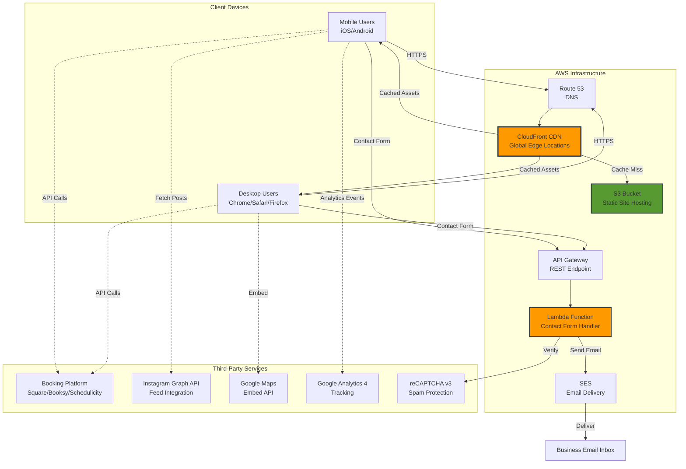
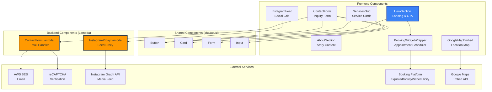
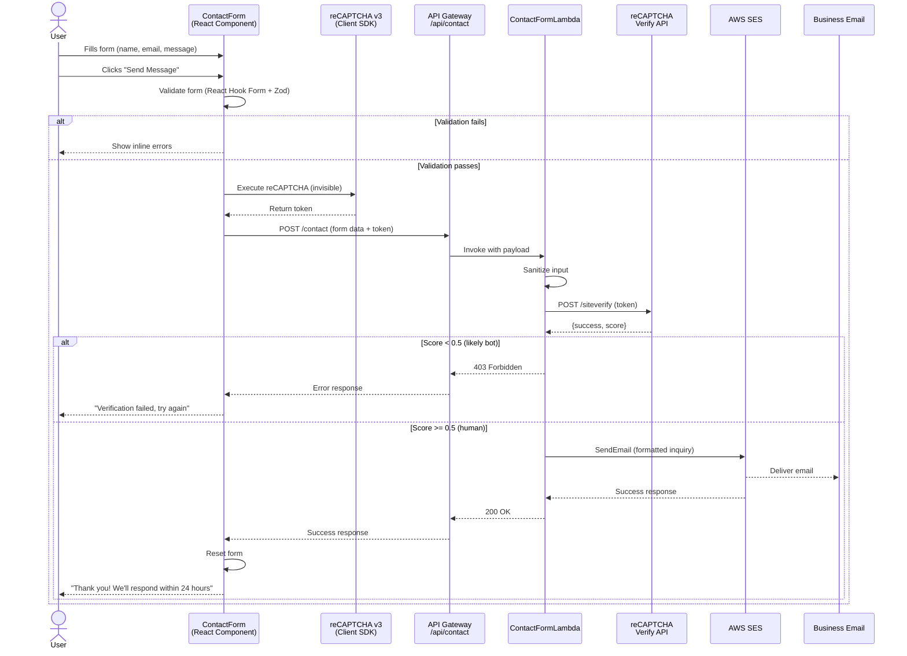
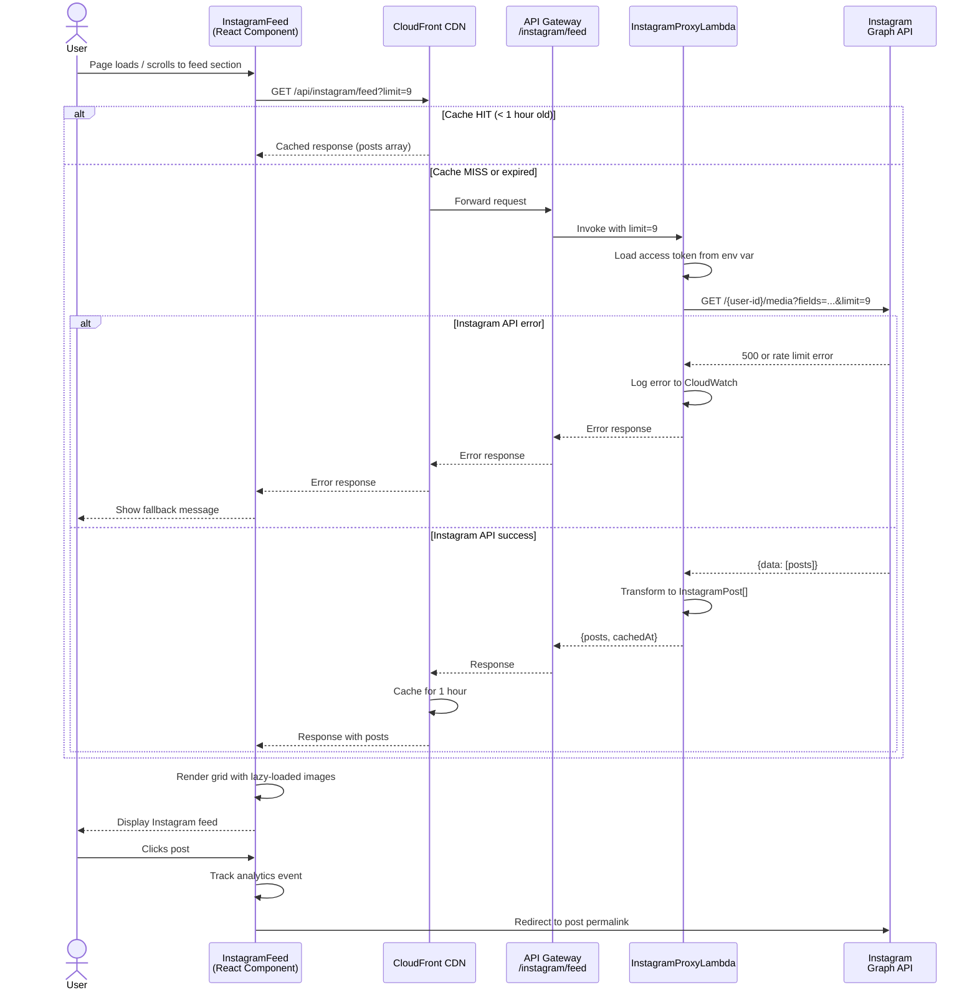
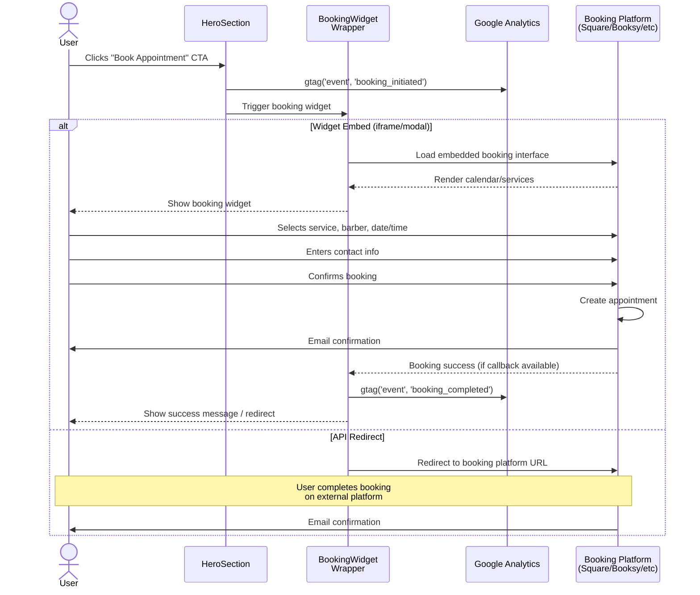
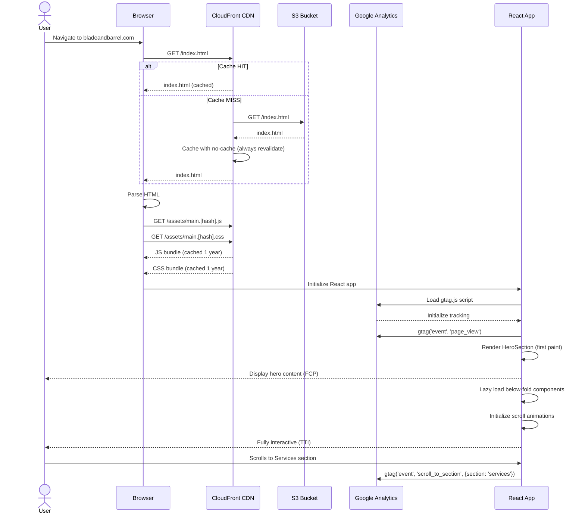
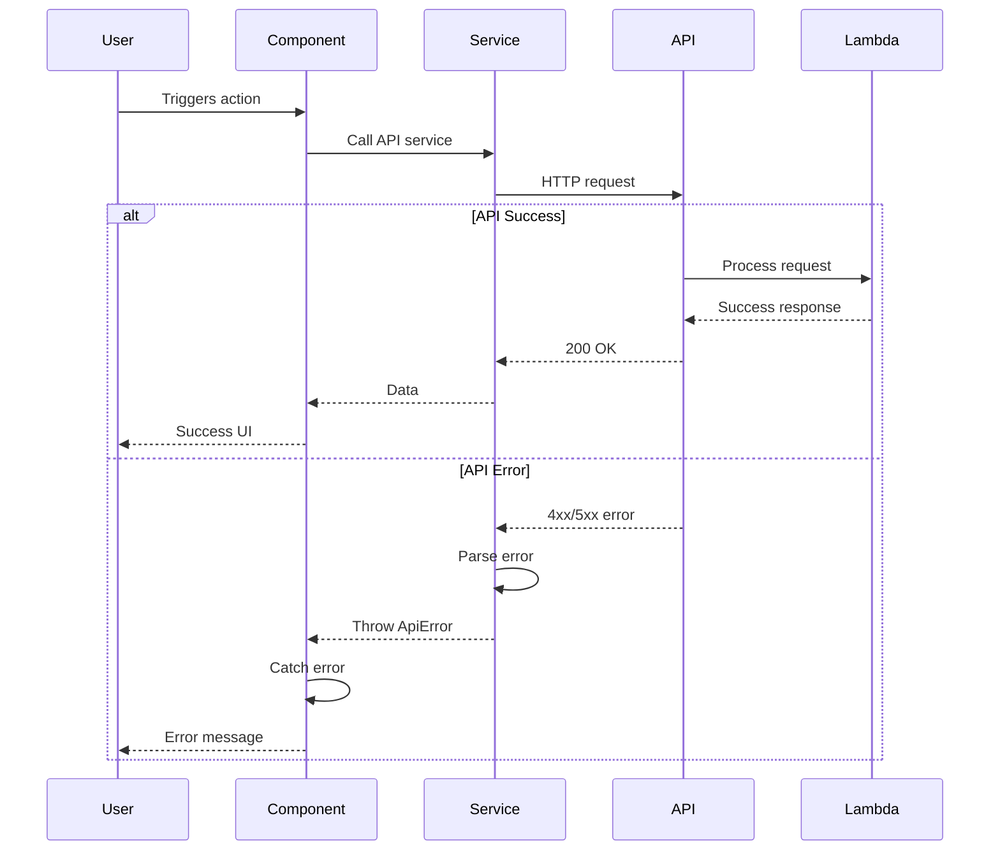

# Blade and Barrel Fullstack Architecture Document

## Introduction

This document outlines the complete fullstack architecture for Blade and Barrel, including backend systems, frontend implementation, and their integration. It serves as the single source of truth for AI-driven development, ensuring consistency across the entire technology stack.

This unified approach combines what would traditionally be separate backend and frontend architecture documents, streamlining the development process for modern fullstack applications where these concerns are increasingly intertwined.

### Starter Template or Existing Project

**Decision:** N/A - Greenfield Custom Build

This is a greenfield project with a carefully selected technology stack optimized for the specific requirements of a high-performance, one-page website with AWS infrastructure.

**Technology Foundation:**
- React 18+ with Vite build tool for fast development and optimized production builds
- shadcn/ui component library with Tailwind CSS for rapid UI development
- Manual AWS infrastructure configuration (S3, CloudFront, Lambda, SES, Route 53)
- Static JAMstack architecture with serverless functions for dynamic features
- Single repository monorepo structure

**Rationale:**
- **Manual AWS setup vs. Amplify:** Team has existing AWS and GitHub CI/CD expertise, enabling full infrastructure control and cost optimization without framework abstraction overhead
- **Custom build vs. starter template:** One-page site scope with aggressive performance requirements (2s load, Lighthouse 85+) benefits from purpose-built optimization
- **JAMstack approach:** Eliminates backend server complexity, reduces operational costs, enables global CDN edge delivery

**Pre-Configured Architectural Decisions:**
- Static site hosting with client-side React interactivity
- Third-party service integrations (booking platform, Instagram Graph API, Google Maps)
- Serverless contact form backend (AWS Lambda + SES)
- No custom database required for MVP

**Flexibility Retained:**
- Booking platform selection (Square Appointments, Booksy, or Schedulicity - evaluated in Epic 3)
- State management approach (React Context for MVP, upgradeable to Zustand if multi-location complexity increases)
- Instagram Graph API integration (business best practice for Instagram Business accounts)

### Glossary of Key Terms

**JAMstack (JavaScript + APIs + Markup):**
An architecture pattern (not a specific technology) that describes building websites with:
- **Markup:** Pre-built static HTML/CSS/JS files (your React build output stored in S3)
- **JavaScript:** Client-side interactivity (React components, animations)
- **APIs:** Dynamic functionality via external APIs and serverless functions (Lambda, Instagram, Booking platform)

*In simple terms:* JAMstack is just a buzzword for the S3 + CloudFront + Lambda approach you're using. It means "static files served fast via CDN, with backend logic handled by APIs."

**Static Site:**
A website where HTML/CSS/JS files are pre-built during deployment (not generated on-demand by a server). Your React app builds to static files that S3 stores.

**CDN (Content Delivery Network):**
A global network of servers (CloudFront) that cache and serve your website files from locations near users. Makes sites load faster worldwide vs. serving from a single S3 bucket region.

**Serverless Functions:**
Code (Lambda) that runs on-demand without managing servers. You only pay when the function executes (e.g., when someone submits the contact form). No idle server costs.

**SPA (Single Page Application):**
A website where navigation happens without full page reloads (React handles routing client-side). Requires special CDN configuration to route all URLs to `index.html`.

**Edge Caching:**
Storing website files at CloudFront edge locations (servers near users) so they load instantly without fetching from origin S3 bucket.

### Change Log

| Date | Version | Description | Author |
|------|---------|-------------|---------|
| 2025-10-05 | v1.0 | Initial fullstack architecture creation | Winston (Architect) |

## High Level Architecture

### Technical Summary

The Blade and Barrel website employs a **static site architecture with serverless backend functions**, optimized for performance, scalability, and cost-efficiency. The React-based single-page application is deployed globally via AWS CloudFront CDN, with dynamic functionality handled through serverless Lambda functions and third-party API integrations. The frontend leverages modern React 18 with Vite for rapid development, shadcn/ui component library for consistent UI, and Framer Motion for scroll-triggered animations that create an immersive storytelling experience. AWS infrastructure (S3 static hosting, CloudFront CDN, Lambda for contact forms, SES for email delivery) provides enterprise-grade reliability within free-tier constraints. Third-party integrations handle specialized functionality: booking platform for appointment scheduling, Instagram Graph API for social proof, Google Maps for location services, and Google Analytics 4 for behavioral tracking. This architecture achieves PRD goals of sub-2-second load times, 85+ Lighthouse scores, and seamless mobile-first experience while maintaining operational simplicity for a small team scaling to multi-location expansion.

### Platform and Infrastructure Choice

**Platform:** AWS (Amazon Web Services)

**Key Services:**
- **AWS S3:** Static website hosting for React build artifacts
- **AWS CloudFront:** Global CDN for sub-2-second load times, HTTPS termination, edge caching
- **AWS Lambda:** Serverless contact form processing (Node.js 20.x runtime)
- **AWS SES (Simple Email Service):** Transactional email delivery for contact inquiries
- **AWS Route 53:** DNS management for bladeandbarrel.com domain
- **AWS Certificate Manager (ACM):** Free SSL/TLS certificates for HTTPS
- **AWS API Gateway:** REST endpoint for Lambda contact form function
- **AWS CloudWatch:** Logging and monitoring for Lambda functions and CloudFront

**Deployment Host and Regions:**
- **Primary Region:** us-east-1 (N. Virginia) - required for CloudFront ACM certificates
- **CloudFront Edge Locations:** Global distribution (Tampa-area edge for local customers)
- **Lambda Deployment:** us-east-1 for proximity to other services

**Rationale:**
- **AWS over Vercel/Netlify:** Team's existing AWS and GitHub CI/CD expertise eliminates learning curve
- **Static site over traditional server:** Zero server maintenance, auto-scaling CDN, cost optimization (estimated $5-15/month)
- **Serverless functions:** Pay-per-execution model ideal for contact form (low volume), no idle server costs
- **CloudFront CDN:** Critical for performance requirements (2s load on 4G mobile, 85+ Lighthouse score)

**Why CloudFront + S3 vs. S3 Alone:**
- ✅ **HTTPS with custom domain:** S3 alone can't serve HTTPS on bladeandbarrel.com (only on `*.s3.amazonaws.com`)
- ✅ **Global edge caching:** CloudFront serves files from locations near users (faster than single-region S3)
- ✅ **SPA routing support:** CloudFront rewrites 404s → `index.html` for React Router (S3 can't do this)
- ✅ **Compression & optimization:** Gzip/Brotli compression reduces file sizes automatically

### Repository Structure

**Structure:** Monorepo (single repository)

**Monorepo Tool:** Not applicable - simple single-app structure managed with npm workspaces (if needed for future shared packages)

**Package Organization:**
```
/blade (root)
├── /src                 # React application source code
├── /public              # Static assets (images, favicons)
├── /components          # shadcn/ui components
├── /lambda              # AWS Lambda function code (contact form)
├── /.github/workflows   # CI/CD GitHub Actions
└── /infrastructure      # AWS config (CloudFront, S3 policies - optional IaC)
```

**Rationale:**
- **Monorepo for simplicity:** One-page website doesn't warrant separate frontend/backend repositories
- **Future-proof:** Structure accommodates shared packages if multi-location features require centralized logic
- **Tooling:** npm workspaces available if needed; current scope doesn't require Turborepo/Nx overhead
- **Lambda separation:** `/lambda` folder isolates serverless function code with separate `package.json` for deployment

### High Level Architecture Diagram



### Architectural Patterns

- **Static Site + Serverless APIs:** Pre-built React site (S3) with serverless functions (Lambda) for dynamic features - _Rationale:_ Optimal performance via CDN edge delivery, auto-scaling, cost-efficiency for one-page site with minimal backend logic

- **Component-Based UI (React):** Reusable React functional components with TypeScript for type safety - _Rationale:_ Maintainability across future multi-location features, shadcn/ui provides battle-tested accessible components, strong ecosystem for hiring

- **Serverless Functions (AWS Lambda):** Event-driven Lambda functions for contact form processing - _Rationale:_ Pay-per-execution eliminates idle server costs, auto-scales for traffic spikes (grand opening), zero maintenance

- **API Gateway Pattern:** Single REST endpoint (`/api/contact`) for Lambda invocation - _Rationale:_ Centralized CORS management, request throttling, CloudWatch logging integration

- **CDN-First Delivery:** CloudFront edge caching with SPA routing configuration - _Rationale:_ Achieves 2s load time requirement on 4G mobile, global performance for future expansion, HTTPS enforcement

- **Third-Party Integration Pattern:** Client-side API calls to external services with server-side proxying for sensitive operations - _Rationale:_ Instagram Graph API requires server-side token handling; booking/maps use client-side embeds for simplicity

- **Progressive Enhancement:** Core content loads first (HTML/CSS), JavaScript hydrates for interactivity - _Rationale:_ Ensures accessibility if JS fails, improves Core Web Vitals (FCP/LCP), graceful degradation for older browsers

- **Atomic Design Components:** Organize UI components from atoms (buttons) → molecules (form fields) → organisms (hero section) - _Rationale:_ shadcn/ui follows this pattern, scales cleanly for design system evolution

## Tech Stack

This is the **DEFINITIVE** technology selection for the entire project. All development must use these exact versions and technologies.

### Technology Stack Table

| Category | Technology | Version | Purpose | Rationale |
|----------|-----------|---------|---------|-----------|
| **Frontend Language** | TypeScript | 5.3+ | Type-safe React development | Catches errors at compile time, improves IDE support, self-documenting code for team collaboration |
| **Frontend Framework** | React | 18.2+ | Component-based UI library | Industry standard, strong ecosystem, team familiarity, shadcn/ui compatibility |
| **Build Tool** | Vite | 5.0+ | Fast development server & optimized builds | 10x faster HMR than CRA, optimized production bundles, native ESM support |
| **UI Component Library** | shadcn/ui | Latest | Pre-built accessible components | Copy-paste components (no dependency bloat), full customization, built on Radix UI primitives, WCAG AA compliant |
| **CSS Framework** | Tailwind CSS | 3.4+ | Utility-first styling | Required by shadcn/ui, rapid development, small production bundle with PurgeCSS, consistent design tokens |
| **Animation Library** | Framer Motion | 11.0+ | Scroll animations & page transitions | Performant 60fps animations, scroll-triggered reveals for storytelling, React-first API |
| **State Management** | React Context API | Built-in (React 18+) | Global UI state | Zero dependencies, sufficient for one-page site (modal state, form handling), upgradeable to Zustand if needed |
| **Form Handling** | React Hook Form | 7.49+ | Contact form validation | Performant uncontrolled forms, integrates with shadcn/ui Form components, built-in validation |
| **Backend Language** | Node.js (JavaScript) | 20.x LTS | Lambda runtime | AWS Lambda native support, team JavaScript familiarity, consistent language across stack |
| **Backend Framework** | None (vanilla Lambda) | N/A | Serverless contact form | Simple single-function use case doesn't warrant Express/Fastify overhead |
| **API Style** | REST | N/A | Contact form endpoint | Simple POST `/api/contact`, lightweight for single endpoint, API Gateway native support |
| **Database** | None | N/A | No persistent storage needed | Static site with third-party data sources (booking platform, Instagram API) |
| **Cache** | CloudFront Edge Cache | Built-in | Static asset caching | Global edge caching for images/JS/CSS, 1-hour TTL for dynamic Instagram feed proxy |
| **File Storage** | AWS S3 | N/A | Static site hosting & image storage | Cost-effective static hosting, integrates with CloudFront, unlimited scalability |
| **Authentication** | None (MVP) | N/A | No user accounts required | Booking platform handles auth, no admin panel needed for MVP |
| **Email Service** | AWS SES | N/A | Contact form delivery | Transactional email, cost-effective ($0.10/1000 emails), integrates with Lambda |
| **Frontend Testing** | Vitest | 1.0+ | React component unit tests | Native Vite integration, Jest-compatible API, faster than Jest |
| **Testing Library** | React Testing Library | 14.0+ | Component integration tests | User-centric testing, accessibility-focused, industry best practice |
| **E2E Testing** | Playwright | 1.40+ (deferred post-MVP) | Critical flow validation | Cross-browser E2E, mobile emulation, deferred to post-launch based on PRD |
| **Linting** | ESLint | 8.56+ | Code quality enforcement | Catches bugs, enforces consistent style, React/TypeScript rules |
| **Formatting** | Prettier | 3.1+ | Automated code formatting | Eliminates style debates, integrates with ESLint, Git hooks for pre-commit |
| **Package Manager** | npm | 10.0+ (Node 20 bundled) | Dependency management | Built-in with Node, team familiarity, workspaces support for future monorepo needs |
| **Bundler** | Vite (Rollup) | Built-in with Vite 5.0+ | Production bundle optimization | Tree-shaking, code splitting, CSS minification, WebP image optimization |
| **IaC Tool** | AWS CLI + GitHub Actions | AWS CLI 2.x | Infrastructure deployment | Manual S3/CloudFront setup documented, CI/CD via GitHub Actions, no Terraform needed for simple stack |
| **CI/CD** | GitHub Actions | N/A | Automated build & deployment | Free for public repos, AWS integration, cache node_modules, invalidate CloudFront on deploy |
| **Monitoring** | AWS CloudWatch | Built-in | Lambda logs & error tracking | Lambda execution logs, API Gateway metrics, free tier includes 5GB logs/month |
| **Error Tracking** | CloudWatch Logs (MVP) | Built-in | Lambda error monitoring | Built-in error capture, upgrade to Sentry post-MVP if needed for client-side errors |
| **Analytics** | Google Analytics 4 | GA4 (gtag.js) | User behavior tracking | Free, event-based tracking, conversion funnels, real-time reports |
| **Spam Protection** | reCAPTCHA v3 | 3.0 | Contact form bot prevention | Invisible (no user interaction), score-based filtering, Google-backed reliability |
| **Booking Integration** | TBD (Story 3.1) | Latest | Appointment scheduling | **DECISION PENDING:** Square Appointments, Booksy, or Schedulicity (evaluated in Epic 3) |
| **Instagram API** | Instagram Graph API | 2.0 (current) | Social feed integration | Business account support, better security than Basic Display API, rate limits 200 calls/hour |
| **Maps** | Google Maps Embed API | N/A | Location section map | Free for static embeds, no API key billing for embed-only usage |
| **Hosting Platform** | AWS S3 + CloudFront | N/A | Static site delivery | Global CDN, HTTPS with custom domain, SPA routing, <$15/month estimated |

## Data Models

Since this is a static site with no database, the data models represent **TypeScript interfaces** that define the shape of data from third-party APIs, forms, and application state. All interfaces will be stored in `/src/types/` for consistent type safety across the application.

### ContactFormSubmission

**Purpose:** Represents user-submitted contact form data for inquiries about events, partnerships, or general questions.

**Key Attributes:**
- `name`: string - Full name of the person submitting the inquiry
- `email`: string - Email address for response (validated format)
- `phone`: string (optional) - Contact phone number
- `message`: string - Inquiry details or question content
- `timestamp`: Date - Submission timestamp (auto-generated)
- `recaptchaToken`: string - reCAPTCHA v3 verification token

#### TypeScript Interface

```typescript
interface ContactFormSubmission {
  name: string;
  email: string;
  phone?: string;
  message: string;
  timestamp: Date;
  recaptchaToken: string;
}

// API request payload (what frontend sends to Lambda)
interface ContactFormRequest {
  name: string;
  email: string;
  phone?: string;
  message: string;
  recaptchaToken: string;
}

// API response (what Lambda returns)
interface ContactFormResponse {
  success: boolean;
  message: string;
  error?: string;
}
```

#### Relationships
- No relationships - standalone form submission sent to Lambda, delivered via SES

---

### InstagramPost

**Purpose:** Represents a single Instagram post fetched from the Instagram Graph API for display in the social feed section.

**Key Attributes:**
- `id`: string - Unique Instagram media ID
- `mediaType`: 'IMAGE' | 'VIDEO' | 'CAROUSEL_ALBUM' - Type of post
- `mediaUrl`: string - URL to the image or video file
- `permalink`: string - Link to the post on Instagram
- `caption`: string (optional) - Post caption text
- `timestamp`: string - ISO 8601 timestamp of post creation
- `likeCount`: number (optional) - Number of likes (if available via permissions)
- `commentsCount`: number (optional) - Number of comments (if available)

**Security & Engagement Decision:**
- Display engagement metrics (likes, comments) **only if available** via Instagram Graph API permissions
- **Primary focus:** High-quality imagery for visual engagement, not vanity metrics
- **Security:** Fetch via server-side Lambda proxy to keep Instagram access token secure (never expose in client bundle)
- **User engagement:** Click-through to Instagram permalink for full post interaction

#### TypeScript Interface

```typescript
interface InstagramPost {
  id: string;
  mediaType: 'IMAGE' | 'VIDEO' | 'CAROUSEL_ALBUM';
  mediaUrl: string;
  permalink: string;
  caption?: string;
  timestamp: string;
  likeCount?: number;    // Optional - only if Graph API permissions allow
  commentsCount?: number; // Optional - only if Graph API permissions allow
}

// API response from Instagram Graph API
interface InstagramFeedResponse {
  data: InstagramPost[];
  paging?: {
    cursors?: {
      before: string;
      after: string;
    };
    next?: string;
  };
}

// Lambda proxy response (cached, secured)
interface InstagramFeedProxyResponse {
  posts: InstagramPost[];
  cachedAt: string;
  error?: string;
}
```

#### Relationships
- Multiple posts displayed in grid layout
- Fetched from Instagram Graph API via server-side Lambda proxy (secures access token)
- Cached for 1 hour at CloudFront edge to respect API rate limits

---

### ServiceOffering

**Purpose:** Represents a barbershop service displayed in the Services section (static content, not from API).

**Key Attributes:**
- `id`: string - Unique identifier (slug format: 'haircut', 'beard-trim')
- `name`: string - Service display name
- `description`: string - Brief service description
- `price`: number - Service price in USD
- `duration`: number - Estimated duration in minutes (optional)

#### TypeScript Interface

```typescript
interface ServiceOffering {
  id: string;
  name: string;
  description: string;
  price: number;
  duration?: number;
}

// Example static data
const SERVICES: ServiceOffering[] = [
  {
    id: 'haircut',
    name: 'Haircut',
    description: 'Precision cut with complimentary draft beer',
    price: 35,
    duration: 45
  },
  {
    id: 'beard-trim',
    name: 'Beard Trim',
    description: 'Expert beard sculpting and grooming',
    price: 25,
    duration: 30
  },
  {
    id: 'hot-towel-shave',
    name: 'Hot Towel Shave',
    description: 'Traditional straight razor shave experience',
    price: 45,
    duration: 60
  }
];
```

#### Relationships
- Static array rendered in Services section
- Future: Could be fetched from booking platform API for dynamic pricing

---

### BookingAppointment

**Purpose:** Type-safe representation of appointment data from the selected booking platform (structure depends on Square/Booksy/Schedulicity selection in Story 3.1).

**Key Attributes:**
- `appointmentId`: string - Unique booking ID from platform
- `serviceId`: string - Selected service
- `barberId`: string (optional) - Selected barber (if customer chooses)
- `dateTime`: string - ISO 8601 appointment date/time
- `customerName`: string - Customer full name
- `customerEmail`: string - Customer email
- `customerPhone`: string - Customer phone number
- `status`: 'pending' | 'confirmed' | 'completed' | 'cancelled' - Booking status

**Note:** This data is managed externally by the booking platform. This interface provides TypeScript completeness for any client-side booking flow interactions.

#### TypeScript Interface

```typescript
interface BookingAppointment {
  appointmentId: string;
  serviceId: string;
  barberId?: string;
  dateTime: string; // ISO 8601 format
  customerName: string;
  customerEmail: string;
  customerPhone: string;
  status: 'pending' | 'confirmed' | 'completed' | 'cancelled';
}

// Booking widget configuration (platform-specific)
interface BookingWidgetConfig {
  apiKey: string;
  businessId: string;
  mode: 'embed' | 'redirect';
  preselectedService?: string;
}

// Example for Square Appointments (if selected)
interface SquareBookingConfig extends BookingWidgetConfig {
  locationId: string;
  embedUrl: string;
}
```

#### Relationships
- Created and managed by booking platform (external system)
- May be referenced if booking platform provides webhook notifications
- Used for TypeScript type safety when interacting with booking widget

---

### AnalyticsEvent

**Purpose:** Type-safe custom event tracking for Google Analytics 4 to measure user engagement and conversion funnels.

**Key Attributes:**
- `eventName`: string - GA4 event name (e.g., 'booking_initiated', 'contact_form_submitted')
- `eventCategory`: string - Event grouping (e.g., 'engagement', 'conversion')
- `eventLabel`: string (optional) - Additional context
- `eventValue`: number (optional) - Numeric value for conversions
- `customParams`: Record<string, any> (optional) - Additional event parameters

#### TypeScript Interface

```typescript
interface AnalyticsEvent {
  eventName: string;
  eventCategory: 'page_view' | 'engagement' | 'conversion' | 'error';
  eventLabel?: string;
  eventValue?: number;
  customParams?: Record<string, any>;
}

// Predefined analytics events for consistency
const ANALYTICS_EVENTS = {
  BOOKING_INITIATED: {
    eventName: 'booking_initiated',
    eventCategory: 'conversion' as const,
    eventLabel: 'Click book appointment CTA'
  },
  CONTACT_FORM_SUBMITTED: {
    eventName: 'contact_form_submitted',
    eventCategory: 'conversion' as const,
    eventLabel: 'Contact form submission'
  },
  INSTAGRAM_POST_CLICKED: {
    eventName: 'instagram_post_clicked',
    eventCategory: 'engagement' as const,
    eventLabel: 'Instagram feed interaction'
  },
  SCROLL_TO_SERVICES: {
    eventName: 'scroll_to_section',
    eventCategory: 'engagement' as const,
    eventLabel: 'Services section viewed'
  }
} as const;

// Helper function for sending events to GA4
declare function trackAnalyticsEvent(event: AnalyticsEvent): void;
```

#### Relationships
- Triggered by user interactions throughout the application
- Sent to Google Analytics 4 via gtag.js
- Used for conversion tracking and user behavior analysis

## API Specification

The API follows REST principles with two serverless endpoints: contact form submission and Instagram feed proxy. Both endpoints are deployed via AWS API Gateway + Lambda.

### REST API Specification

```yaml
openapi: 3.0.0
info:
  title: Blade and Barrel API
  version: 1.0.0
  description: Serverless REST API for Blade and Barrel website - contact form submission and Instagram feed proxy

servers:
  - url: https://api.bladeandbarrel.com
    description: Production API Gateway endpoint
  - url: https://dev-api.bladeandbarrel.com
    description: Development/staging environment

paths:
  /contact:
    post:
      summary: Submit contact form inquiry
      description: Processes contact form submissions, validates reCAPTCHA, and sends email via AWS SES
      operationId: submitContactForm
      tags:
        - Contact
      requestBody:
        required: true
        content:
          application/json:
            schema:
              $ref: '#/components/schemas/ContactFormRequest'
            example:
              name: "John Doe"
              email: "john@example.com"
              phone: "+1-555-123-4567"
              message: "I'm interested in booking a private event for 20 people. Can you provide details?"
              recaptchaToken: "03AGdBq27..."
      responses:
        '200':
          description: Contact form successfully submitted
          content:
            application/json:
              schema:
                $ref: '#/components/schemas/ContactFormResponse'
              example:
                success: true
                message: "Thank you! We'll get back to you within 24 hours."
        '400':
          description: Invalid request (validation errors)
          content:
            application/json:
              schema:
                $ref: '#/components/schemas/ErrorResponse'
              example:
                success: false
                error: "Invalid email format"
        '403':
          description: reCAPTCHA verification failed (likely bot)
          content:
            application/json:
              schema:
                $ref: '#/components/schemas/ErrorResponse'
              example:
                success: false
                error: "reCAPTCHA verification failed. Please try again."
        '500':
          description: Internal server error (SES failure, Lambda error)
          content:
            application/json:
              schema:
                $ref: '#/components/schemas/ErrorResponse'
              example:
                success: false
                error: "Failed to send email. Please try again later."
      security:
        - corsOrigin: []

  /instagram/feed:
    get:
      summary: Fetch Instagram feed (server-side proxy)
      description: Proxies Instagram Graph API requests to secure access token, returns cached posts
      operationId: getInstagramFeed
      tags:
        - Instagram
      parameters:
        - name: limit
          in: query
          description: Number of posts to fetch (default 9, max 25)
          required: false
          schema:
            type: integer
            default: 9
            minimum: 1
            maximum: 25
      responses:
        '200':
          description: Instagram feed successfully fetched
          content:
            application/json:
              schema:
                $ref: '#/components/schemas/InstagramFeedProxyResponse'
              example:
                posts:
                  - id: "17895695668004550"
                    mediaType: "IMAGE"
                    mediaUrl: "https://scontent.cdninstagram.com/..."
                    permalink: "https://www.instagram.com/p/ABC123/"
                    caption: "Fresh cuts and cold brews at Blade and Barrel!"
                    timestamp: "2025-10-04T14:30:00Z"
                    likeCount: 145
                    commentsCount: 12
                cachedAt: "2025-10-05T10:00:00Z"
        '500':
          description: Instagram API error or cache failure
          content:
            application/json:
              schema:
                $ref: '#/components/schemas/ErrorResponse'
              example:
                error: "Failed to fetch Instagram feed"
      security:
        - corsOrigin: []

components:
  schemas:
    ContactFormRequest:
      type: object
      required:
        - name
        - email
        - message
        - recaptchaToken
      properties:
        name:
          type: string
          minLength: 2
          maxLength: 100
          example: "John Doe"
        email:
          type: string
          format: email
          example: "john@example.com"
        phone:
          type: string
          pattern: '^\+?[0-9\s\-\(\)]+$'
          example: "+1-555-123-4567"
        message:
          type: string
          minLength: 10
          maxLength: 1000
          example: "I'm interested in booking a private event..."
        recaptchaToken:
          type: string
          description: reCAPTCHA v3 verification token
          example: "03AGdBq27..."

    ContactFormResponse:
      type: object
      properties:
        success:
          type: boolean
        message:
          type: string
        error:
          type: string

    InstagramPost:
      type: object
      properties:
        id:
          type: string
        mediaType:
          type: string
          enum: [IMAGE, VIDEO, CAROUSEL_ALBUM]
        mediaUrl:
          type: string
          format: uri
        permalink:
          type: string
          format: uri
        caption:
          type: string
        timestamp:
          type: string
          format: date-time
        likeCount:
          type: integer
        commentsCount:
          type: integer

    InstagramFeedProxyResponse:
      type: object
      properties:
        posts:
          type: array
          items:
            $ref: '#/components/schemas/InstagramPost'
        cachedAt:
          type: string
          format: date-time
        error:
          type: string

    ErrorResponse:
      type: object
      properties:
        success:
          type: boolean
          default: false
        error:
          type: string

  securitySchemes:
    corsOrigin:
      type: apiKey
      in: header
      name: Origin
      description: CORS restricted to bladeandbarrel.com domain
```

**Key API Design Decisions:**

**Authentication & Security:**
- No API keys required for public endpoints (CORS restricts to bladeandbarrel.com origin)
- reCAPTCHA v3 validates contact form submissions server-side
- Instagram access token never exposed to client (proxied through Lambda)

**Caching Strategy:**
- Instagram feed: Cached at CloudFront edge for 1 hour (respects 200 calls/hour rate limit)
- Contact form: No caching (each submission processed immediately)

**Error Handling:**
- 4xx errors: Client validation failures (bad email, reCAPTCHA fail)
- 5xx errors: Server-side issues (SES failure, Lambda timeout, Instagram API down)
- Consistent error format: All errors return `{success: false, error: "message"}`

**Rate Limiting:**
- API Gateway: 1000 requests/second burst, 5000 requests/hour steady state (AWS default)
- Contact form: Consider adding custom rate limit (10 submissions/hour per IP) to prevent abuse

## Components

Based on the architectural patterns, tech stack, and data models, the following components form the complete system architecture across frontend and backend.

### Frontend Components

#### HeroSection

**Responsibility:** Full-screen landing section with brand messaging and primary booking CTA

**Key Interfaces:**
- Props: `{ tagline: string, ctaText: string, onBookingClick: () => void }`
- Renders: Background image, animated tagline, booking button
- Emits: `booking_initiated` analytics event on CTA click

**Dependencies:** Framer Motion (scroll animations), booking widget integration

**Technology Stack:** React functional component, Tailwind CSS, Framer Motion `motion.div`, responsive background image with `<picture>` element

---

#### ServicesGrid

**Responsibility:** Display barbershop services with pricing in responsive card layout

**Key Interfaces:**
- Props: `{ services: ServiceOffering[] }`
- Renders: shadcn/ui Card components in grid layout
- State: None (static data)

**Dependencies:** shadcn/ui Card component, ServiceOffering data model

**Technology Stack:** React functional component, Tailwind grid layout, shadcn/ui Card, scroll-triggered fade-in animation

---

#### ContactForm

**Responsibility:** Collect and validate customer inquiries, submit to Lambda backend

**Key Interfaces:**
- Props: None (self-contained)
- State: Form data (`ContactFormRequest`), submission status, validation errors
- API: POST `/api/contact` with reCAPTCHA token
- Emits: `contact_form_submitted` analytics event on success

**Dependencies:** React Hook Form, shadcn/ui Form components, reCAPTCHA v3, API client

**Technology Stack:** React Hook Form + Zod validation schema, shadcn/ui Input/Textarea/Button, reCAPTCHA invisible widget

---

#### InstagramFeed

**Responsibility:** Fetch and display recent Instagram posts in grid layout

**Key Interfaces:**
- Props: `{ limit?: number }`
- State: Instagram posts array, loading state, error state
- API: GET `/api/instagram/feed`
- Emits: `instagram_post_clicked` analytics event on post click

**Dependencies:** Instagram feed API proxy, lazy loading for images

**Technology Stack:** React functional component with `useEffect` hook, Tailwind grid, lazy loading via `loading="lazy"`, fallback skeleton UI

---

#### GoogleMapEmbed

**Responsibility:** Display business location with interactive Google Map

**Key Interfaces:**
- Props: `{ address: string, businessName: string }`
- Renders: Embedded Google Maps iframe with location pin

**Dependencies:** Google Maps Embed API

**Technology Stack:** React component wrapping `<iframe>`, responsive container, ARIA labels for accessibility

---

#### BookingWidgetWrapper

**Responsibility:** Embed third-party booking platform (Square/Booksy/Schedulicity) for appointment scheduling

**Key Interfaces:**
- Props: `{ config: BookingWidgetConfig, preselectedService?: string }`
- Renders: Platform-specific embed (iframe or redirect button)
- Emits: `booking_initiated` analytics event on widget interaction

**Dependencies:** Selected booking platform SDK/embed code (Story 3.1)

**Technology Stack:** React component with platform-specific integration (iframe, script tag, or API redirect)

---

### Backend Components

#### ContactFormLambda

**Responsibility:** Process contact form submissions, validate reCAPTCHA, send email via SES

**Key Interfaces:**
- Input: API Gateway event with `ContactFormRequest` payload
- Output: `ContactFormResponse` (success/error)
- External APIs: Google reCAPTCHA verification, AWS SES

**Dependencies:** AWS SDK (SES), axios/node-fetch (reCAPTCHA verification), input sanitization library

**Technology Stack:** Node.js 20.x Lambda function, `@aws-sdk/client-ses` v3, environment variables for secrets

---

#### InstagramProxyLambda

**Responsibility:** Proxy Instagram Graph API requests to secure access token, cache responses

**Key Interfaces:**
- Input: API Gateway event with query parameter `limit`
- Output: `InstagramFeedProxyResponse`
- External APIs: Instagram Graph API (GET `/me/media`)

**Dependencies:** Instagram Graph API, CloudFront caching (1-hour TTL)

**Technology Stack:** Node.js 20.x Lambda function, node-fetch for HTTP requests, environment variables for Instagram access token

---

### Component Diagram



## External APIs

This section documents all third-party API integrations required for the project.

### Instagram Graph API

**Purpose:** Fetch recent Instagram posts to display in social feed section for brand engagement and social proof

**Documentation:** https://developers.facebook.com/docs/instagram-api

**Base URL(s):**
- Production: `https://graph.instagram.com/v18.0`
- Token Exchange: `https://api.instagram.com/oauth/access_token`

**Authentication:**
- OAuth 2.0 with long-lived access token (60 days)
- Token stored securely in Lambda environment variables (never exposed to client)
- Refresh token workflow required to maintain access beyond 60 days

**Rate Limits:**
- 200 API calls per hour per user
- Burst limit: 4800 calls per day

**Key Endpoints Used:**
- `GET /{user-id}/media` - Fetch list of user's media objects (posts)
  - **Query params:** `fields=id,media_type,media_url,permalink,caption,timestamp,like_count,comments_count`, `limit=25`
  - **Returns:** Array of Instagram post objects

**Integration Notes:**
- **Security:** Access token must be server-side only (Lambda proxy prevents client exposure)
- **Caching:** Implement 1-hour cache at CloudFront edge to stay within rate limits
- **Permissions:** Requires `instagram_graph_user_profile` and `instagram_graph_user_media` permissions
- **Business Account Required:** Must link Instagram Business/Creator account to Facebook Page
- **Error Handling:** Graceful fallback if API unavailable (show cached posts or placeholder message)
- **Token Refresh:** Implement automated token refresh workflow before 60-day expiration

---

### Google reCAPTCHA v3 API

**Purpose:** Invisible spam protection for contact form submissions (bot detection without user interaction)

**Documentation:** https://developers.google.com/recaptcha/docs/v3

**Base URL(s):**
- Client-side script: `https://www.google.com/recaptcha/api.js`
- Server-side verification: `https://www.google.com/recaptcha/api/siteverify`

**Authentication:**
- Site Key: Public key embedded in frontend (safe to expose)
- Secret Key: Private key used in Lambda for server-side verification (environment variable)

**Rate Limits:**
- 1000 requests/second per site key (generous, unlikely to hit)

**Key Endpoints Used:**
- `POST /siteverify` - Verify reCAPTCHA token from client submission
  - **Body params:** `secret`, `response` (token), `remoteip` (optional)
  - **Returns:** `{ success: true/false, score: 0.0-1.0, action: "submit", ... }`

**Integration Notes:**
- **Score Threshold:** Accept submissions with score ≥ 0.5 (adjust based on spam patterns)
- **Frontend:** Load reCAPTCHA script, execute on form submit to get token
- **Backend (Lambda):** Verify token before processing contact form
- **Privacy:** Update privacy policy to disclose reCAPTCHA usage per Google's terms
- **Fallback:** If verification API fails, log error and optionally allow submission (or reject with user-friendly message)

---

### Google Maps Embed API

**Purpose:** Display interactive map showing business location in Location & Hours section

**Documentation:** https://developers.google.com/maps/documentation/embed/get-started

**Base URL(s):**
- Embed: `https://www.google.com/maps/embed/v1/{MODE}`

**Authentication:**
- API Key (optional for basic embeds, recommended for production)
- Restrict key to bladeandbarrel.com domain for security

**Rate Limits:**
- Unlimited for static embeds (no API key required if using iframe only)
- If using API key: Generous limits (unlikely to hit for single location)

**Key Endpoints Used:**
- `GET /maps/embed/v1/place` - Embed map with place marker
  - **Query params:** `key={API_KEY}`, `q=Blade+and+Barrel,Channelside+Tampa,FL`
  - **Returns:** Embedded map iframe

**Integration Notes:**
- **Simple Implementation:** Use basic iframe embed without API key for MVP
- **Enhanced Features (Future):** API key enables directions, Street View, custom styling
- **Accessibility:** Add ARIA label to iframe ("Map showing Blade and Barrel location")
- **Responsive:** Iframe must resize for mobile (use container with aspect-ratio CSS)
- **Privacy:** Embedded maps don't require cookie consent banner (no tracking cookies set)

---

### Booking Platform API (TBD - Story 3.1)

**Purpose:** Enable customers to book barbershop appointments directly from website

**Platform Options (Research Phase):**
1. **Square Appointments**
   - **Docs:** https://developer.squareup.com/docs/appointments-api/what-it-does
   - **Auth:** OAuth 2.0 or API key
   - **Integration:** Widget embed or API-driven booking flow

2. **Booksy**
   - **Docs:** https://booksy.com/en-us/integration
   - **Auth:** API key or widget embed code
   - **Integration:** Iframe widget (simpler) or REST API

3. **Schedulicity**
   - **Docs:** https://www.schedulicity.com/integration
   - **Auth:** Embed widget (no API required)
   - **Integration:** JavaScript widget or iframe

**Decision Criteria (Story 3.1):**
- Mobile booking experience quality (70%+ traffic is mobile)
- Integration complexity (widget embed vs. API)
- Pricing for barbershop use case (8 barbers, estimated volume)
- Client notification features (email/SMS confirmations)

**Integration Notes:**
- **Final selection determines implementation:** Widget embed (simplest), API redirect, or custom API integration
- **Testing:** Validate booking flow end-to-end on mobile and desktop before launch
- **Analytics:** Track `booking_initiated` event when user interacts with booking interface

---

### Google Analytics 4

**Purpose:** Track user behavior, conversion funnels, and traffic sources for data-driven optimization

**Documentation:** https://developers.google.com/analytics/devguides/collection/ga4

**Base URL(s):**
- Tracking script: `https://www.googletagmanager.com/gtag/js?id=G-XXXXXXXXXX`

**Authentication:**
- Measurement ID (G-XXXXXXXXXX) - public, embedded in client-side code

**Rate Limits:**
- No strict rate limits for standard tracking (10M events/month free tier)

**Key Endpoints Used:**
- Client-side `gtag()` function for event tracking
- Automatic page view tracking on script load
- Custom events: `gtag('event', 'booking_initiated', { ... })`

**Integration Notes:**
- **Event Tracking:** Use predefined `ANALYTICS_EVENTS` constants for consistency
- **Privacy Compliance:** Add privacy policy disclosure, consider cookie consent banner for EU traffic
- **Conversion Tracking:** Set up conversion goals in GA4 dashboard (booking clicks, contact form submissions)
- **Real-time Monitoring:** Use real-time reports during launch to validate tracking
- **Custom Dimensions:** Track service type selected, section scrolled to, Instagram post clicked

## Core Workflows

These sequence diagrams illustrate critical user journeys showing component interactions across frontend, backend, and external services.

### Contact Form Submission Flow



### Instagram Feed Loading Flow



### Booking Appointment Flow



### Page Load & Analytics Tracking Flow



## Database Schema

**Database:** None required for MVP

**Rationale:**
- **Booking data:** Managed externally by booking platform (Square/Booksy/Schedulicity)
- **Contact form submissions:** Delivered immediately via SES email (no storage needed)
- **Instagram posts:** Fetched dynamically from Instagram Graph API (cached at CloudFront edge)
- **Service offerings:** Static content hardcoded in React components
- **Analytics data:** Stored in Google Analytics 4 (external service)

**Future Considerations:**
- If multi-location expansion requires centralized appointment management, consider adding DynamoDB or RDS
- If admin panel needed for content management, add database for CMS functionality
- If user accounts required (loyalty program), add authentication database

## Frontend Architecture

### Component Architecture

#### Component Organization

```
/src
├── /components         # Page-level components
│   ├── HeroSection.tsx
│   ├── ServicesGrid.tsx
│   ├── AboutSection.tsx
│   ├── InstagramFeed.tsx
│   ├── ContactForm.tsx
│   ├── GoogleMapEmbed.tsx
│   └── BookingWidgetWrapper.tsx
├── /components/ui      # shadcn/ui base components
│   ├── button.tsx
│   ├── card.tsx
│   ├── form.tsx
│   ├── input.tsx
│   └── textarea.tsx
├── /lib                # Utilities and helpers
│   ├── utils.ts        # Class name utilities, etc.
│   └── analytics.ts    # GA4 tracking helpers
├── /services           # API client services
│   ├── api.ts          # Axios instance configuration
│   ├── contactService.ts
│   └── instagramService.ts
├── /types              # TypeScript interfaces
│   ├── index.ts        # Export all types
│   ├── contact.ts
│   ├── instagram.ts
│   └── analytics.ts
├── /hooks              # Custom React hooks
│   ├── useAnalytics.ts
│   └── useIntersectionObserver.ts
├── /constants          # Static data
│   └── services.ts     # SERVICES array
├── App.tsx             # Main app component
└── main.tsx            # React entry point
```

#### Component Template

```typescript
// HeroSection.tsx - Typical component structure
import { motion } from 'framer-motion';
import { Button } from '@/components/ui/button';
import { useAnalytics } from '@/hooks/useAnalytics';

interface HeroSectionProps {
  tagline: string;
  ctaText: string;
  onBookingClick: () => void;
}

export function HeroSection({ tagline, ctaText, onBookingClick }: HeroSectionProps) {
  const { trackEvent } = useAnalytics();

  const handleBookingClick = () => {
    trackEvent('booking_initiated', {
      eventCategory: 'conversion',
      eventLabel: 'Hero CTA clicked'
    });
    onBookingClick();
  };

  return (
    <motion.section
      initial={{ opacity: 0 }}
      animate={{ opacity: 1 }}
      transition={{ duration: 0.8 }}
      className="relative h-screen flex items-center justify-center"
    >
      <picture>
        <source srcSet="/hero.webp" type="image/webp" />
        
      </picture>

      <div className="relative z-10 text-center text-white">
        <h1 className="text-5xl md:text-7xl font-bold mb-6">{tagline}</h1>
        <Button size="lg" onClick={handleBookingClick}>
          {ctaText}
        </Button>
      </div>
    </motion.section>
  );
}
```

### State Management Architecture

#### State Structure

```typescript
// /src/contexts/AppContext.tsx
import { createContext, useContext, useState, ReactNode } from 'react';

interface AppContextType {
  isMobileMenuOpen: boolean;
  setMobileMenuOpen: (open: boolean) => void;
  isBookingModalOpen: boolean;
  setBookingModalOpen: (open: boolean) => void;
}

const AppContext = createContext<AppContextType | undefined>(undefined);

export function AppProvider({ children }: { children: ReactNode }) {
  const [isMobileMenuOpen, setMobileMenuOpen] = useState(false);
  const [isBookingModalOpen, setBookingModalOpen] = useState(false);

  return (
    <AppContext.Provider value={{
      isMobileMenuOpen,
      setMobileMenuOpen,
      isBookingModalOpen,
      setBookingModalOpen
    }}>
      {children}
    </AppContext.Provider>
  );
}

export function useApp() {
  const context = useContext(AppContext);
  if (!context) throw new Error('useApp must be used within AppProvider');
  return context;
}
```

#### State Management Patterns

- **React Context for global UI state:** Mobile menu open/close, booking modal visibility
- **Component local state for forms:** React Hook Form manages contact form state internally
- **API data in component state:** Instagram feed data fetched with `useEffect`, stored in `useState`
- **No Redux/Zustand needed:** Minimal state requirements for one-page site

### Routing Architecture

#### Route Organization

```
# No routing library needed for one-page site
# Smooth scroll to sections using anchor links

Single page application with scroll-based navigation:
- / (root) → Full page with all sections
- Anchor links (#services, #contact) scroll to sections
- No React Router required
```

#### Protected Route Pattern

```typescript
// Not applicable - no authentication or protected routes for MVP
// Future: If admin panel added, implement protected routes with React Router
```

### Frontend Services Layer

#### API Client Setup

```typescript
// /src/services/api.ts
import axios from 'axios';

export const apiClient = axios.create({
  baseURL: import.meta.env.VITE_API_BASE_URL || 'https://api.bladeandbarrel.com',
  timeout: 10000,
  headers: {
    'Content-Type': 'application/json'
  }
});
```

#### Service Example

```typescript
// /src/services/contactService.ts
import { apiClient } from './api';
import type { ContactFormRequest, ContactFormResponse } from '@/types/contact';

export async function submitContactForm(data: ContactFormRequest): Promise<ContactFormResponse> {
  const response = await apiClient.post<ContactFormResponse>('/contact', data);
  return response.data;
}

// /src/services/instagramService.ts
import { apiClient } from './api';
import type { InstagramFeedProxyResponse } from '@/types/instagram';

export async function fetchInstagramFeed(limit: number = 9): Promise<InstagramFeedProxyResponse> {
  const response = await apiClient.get<InstagramFeedProxyResponse>(`/instagram/feed?limit=${limit}`);
  return response.data;
}
```

## Backend Architecture

### Service Architecture

#### Function Organization

```
/lambda
├── /contact-form
│   ├── index.js           # Handler function
│   ├── package.json       # Dependencies (@aws-sdk/client-ses, etc.)
│   └── utils/
│       ├── validate.js    # Input sanitization
│       └── recaptcha.js   # reCAPTCHA verification
├── /instagram-proxy
│   ├── index.js           # Handler function
│   ├── package.json       # Dependencies (node-fetch)
│   └── utils/
│       └── transform.js   # Transform Instagram API response
└── /shared                # Shared utilities (if needed)
    └── logger.js
```

#### Function Template

```javascript
// /lambda/contact-form/index.js
const { SESClient, SendEmailCommand } = require('@aws-sdk/client-ses');
const { validateInput } = require('./utils/validate');
const { verifyRecaptcha } = require('./utils/recaptcha');

const sesClient = new SESClient({ region: 'us-east-1' });

exports.handler = async (event) => {
  try {
    const body = JSON.parse(event.body);

    // Validate and sanitize input
    const validatedData = validateInput(body);

    // Verify reCAPTCHA
    const recaptchaValid = await verifyRecaptcha(
      body.recaptchaToken,
      event.requestContext.identity.sourceIp
    );

    if (!recaptchaValid) {
      return {
        statusCode: 403,
        body: JSON.stringify({
          success: false,
          error: 'reCAPTCHA verification failed'
        })
      };
    }

    // Send email via SES
    const emailParams = {
      Source: process.env.FROM_EMAIL,
      Destination: { ToAddresses: [process.env.TO_EMAIL] },
      Message: {
        Subject: { Data: 'Blade and Barrel Website Inquiry' },
        Body: {
          Text: {
            Data: `Name: ${validatedData.name}\nEmail: ${validatedData.email}\nPhone: ${validatedData.phone || 'N/A'}\n\nMessage:\n${validatedData.message}`
          }
        }
      },
      ReplyToAddresses: [validatedData.email]
    };

    await sesClient.send(new SendEmailCommand(emailParams));

    return {
      statusCode: 200,
      headers: { 'Content-Type': 'application/json' },
      body: JSON.stringify({
        success: true,
        message: 'Thank you! We'll get back to you within 24 hours.'
      })
    };

  } catch (error) {
    console.error('Contact form error:', error);
    return {
      statusCode: 500,
      body: JSON.stringify({
        success: false,
        error: 'Failed to send message. Please try again.'
      })
    };
  }
};
```

### Database Architecture

**Not applicable** - No database required. See Database Schema section above for rationale and future considerations.

## Unified Project Structure

Complete monorepo structure accommodating both frontend and backend:

```
blade/ (root)
├── .github/
│   └── workflows/
│       ├── ci.yml                    # Run tests and linting
│       └── deploy.yml                # Build and deploy to AWS
│
├── src/                              # React frontend application
│   ├── components/
│   │   ├── HeroSection.tsx
│   │   ├── ServicesGrid.tsx
│   │   ├── AboutSection.tsx
│   │   ├── InstagramFeed.tsx
│   │   ├── ContactForm.tsx
│   │   ├── GoogleMapEmbed.tsx
│   │   └── BookingWidgetWrapper.tsx
│   ├── components/ui/                # shadcn/ui components
│   │   ├── button.tsx
│   │   ├── card.tsx
│   │   ├── form.tsx
│   │   ├── input.tsx
│   │   └── textarea.tsx
│   ├── contexts/
│   │   └── AppContext.tsx
│   ├── hooks/
│   │   ├── useAnalytics.ts
│   │   └── useIntersectionObserver.ts
│   ├── services/
│   │   ├── api.ts
│   │   ├── contactService.ts
│   │   └── instagramService.ts
│   ├── types/
│   │   ├── index.ts
│   │   ├── contact.ts
│   │   ├── instagram.ts
│   │   └── analytics.ts
│   ├── lib/
│   │   ├── utils.ts
│   │   └── analytics.ts
│   ├── constants/
│   │   └── services.ts
│   ├── assets/                       # Images, fonts, etc.
│   ├── App.tsx
│   ├── main.tsx
│   └── index.css
│
├── public/                           # Static assets
│   ├── images/
│   │   ├── hero.webp
│   │   ├── hero.jpg
│   │   └── logo.svg
│   └── favicon.ico
│
├── lambda/                           # AWS Lambda functions
│   ├── contact-form/
│   │   ├── index.js
│   │   ├── package.json
│   │   └── utils/
│   │       ├── validate.js
│   │       └── recaptcha.js
│   ├── instagram-proxy/
│   │   ├── index.js
│   │   ├── package.json
│   │   └── utils/
│   │       └── transform.js
│   └── shared/
│       └── logger.js
│
├── infrastructure/                   # AWS infrastructure configs (optional)
│   ├── cloudfront-config.json
│   ├── s3-bucket-policy.json
│   └── api-gateway-config.json
│
├── tests/                            # Test files
│   ├── unit/
│   │   ├── components/
│   │   └── services/
│   └── integration/
│
├── docs/                             # Documentation
│   ├── prd.md
│   ├── architecture.md
│   └── deployment-guide.md
│
├── scripts/                          # Build and deployment scripts
│   ├── deploy-lambda.sh
│   └── invalidate-cloudfront.sh
│
├── .env.example                      # Environment variable template
├── .env.local                        # Local development env vars (gitignored)
├── .gitignore
├── package.json                      # Root package.json
├── tsconfig.json                     # TypeScript configuration
├── vite.config.ts                    # Vite build configuration
├── tailwind.config.js                # Tailwind CSS configuration
├── components.json                   # shadcn/ui configuration
├── eslint.config.js                  # ESLint configuration
├── .prettierrc                       # Prettier configuration
└── README.md
```

**Key Organization Principles:**
- **/src for frontend:** All React code isolated in src directory
- **/lambda for backend:** Serverless functions separate from frontend
- **/public for static assets:** Images, favicons, fonts served directly
- **/.github/workflows for CI/CD:** GitHub Actions deployment automation
- **/infrastructure for IaC:** Optional AWS configuration files for reference
- **/tests for all testing:** Unit and integration tests organized by type

## Development Workflow

### Local Development Setup

#### Prerequisites

```bash
# Required software
node --version  # v20.x LTS required
npm --version   # v10.x (bundled with Node 20)
git --version   # Latest stable

# AWS CLI (for Lambda deployment and infrastructure)
aws --version   # v2.x

# Optional but recommended
code --version  # VS Code for TypeScript support
```

#### Initial Setup

```bash
# Clone repository
git clone https://github.com/bladeandbarrel/website.git
cd blade

# Install dependencies
npm install

# Copy environment template
cp .env.example .env.local

# Configure environment variables
# Edit .env.local with your API keys:
# - VITE_API_BASE_URL
# - VITE_GA4_MEASUREMENT_ID
# - VITE_RECAPTCHA_SITE_KEY
# - VITE_INSTAGRAM_BUSINESS_ACCOUNT_ID

# Install Lambda dependencies
cd lambda/contact-form && npm install && cd ../..
cd lambda/instagram-proxy && npm install && cd ../..

# Start development server
npm run dev
```

#### Development Commands

```bash
# Start all services (frontend only for local dev)
npm run dev              # Vite dev server on http://localhost:5173

# Frontend-specific commands
npm run build            # Production build
npm run preview          # Preview production build locally
npm run lint             # Run ESLint
npm run format           # Run Prettier
npm run type-check       # TypeScript type checking

# Testing commands
npm run test             # Run Vitest unit tests
npm run test:watch       # Run tests in watch mode
npm run test:coverage    # Generate coverage report

# Lambda local testing (requires AWS SAM CLI)
cd lambda/contact-form
node index.js           # Run handler locally with test event

# Build Lambda for deployment
cd lambda/contact-form && npm run build && cd ../..
```

### Environment Configuration

#### Required Environment Variables

```bash
# Frontend (.env.local)
VITE_API_BASE_URL=https://api.bladeandbarrel.com
VITE_GA4_MEASUREMENT_ID=G-XXXXXXXXXX
VITE_RECAPTCHA_SITE_KEY=6LxxxxxxxxxxxxxxxxxxxxxxxxxxxxxxxxxxxxxxE
VITE_INSTAGRAM_BUSINESS_ACCOUNT_ID=17841400000000000
VITE_GOOGLE_MAPS_EMBED_API_KEY=AIzaSyXXXXXXXXXXXXXXXXXXXXXXXXXXXX  # Optional

# Backend Lambda (.env for deployment - NOT committed)
FROM_EMAIL=noreply@bladeandbarrel.com
TO_EMAIL=info@bladeandbarrel.com
RECAPTCHA_SECRET_KEY=6LxxxxxxxxxxxxxxxxxxxxxxxxxxxxxxxxxxxxxxE
INSTAGRAM_ACCESS_TOKEN=IGQVJxxxxxxxxxxxxxxxxxxxxxxxxxxxxxxxxxxxxxxxxx

# AWS Deployment (GitHub Secrets)
AWS_ACCESS_KEY_ID=AKIAXXXXXXXXXXXXXXXXX
AWS_SECRET_ACCESS_KEY=xxxxxxxxxxxxxxxxxxxxxxxxxxxxxxxxxxxxxxxx
AWS_REGION=us-east-1
S3_BUCKET=bladeandbarrel-website
CLOUDFRONT_DISTRIBUTION_ID=E1XXXXXXXXXX
```

## Deployment Architecture

### Deployment Strategy

**Frontend Deployment:**
- **Platform:** AWS S3 + CloudFront CDN
- **Build Command:** `npm run build`
- **Output Directory:** `dist/`
- **CDN/Edge:** CloudFront global edge locations with 1-year cache for assets, no-cache for index.html

**Backend Deployment:**
- **Platform:** AWS Lambda + API Gateway
- **Build Command:** `cd lambda/{function} && npm install --production`
- **Deployment Method:** ZIP upload via AWS CLI or GitHub Actions

### CI/CD Pipeline

```yaml
# .github/workflows/deploy.yml
name: Deploy to AWS

on:
  push:
    branches: [main]
  workflow_dispatch:

jobs:
  deploy-frontend:
    runs-on: ubuntu-latest
    steps:
      - uses: actions/checkout@v4

      - name: Setup Node.js
        uses: actions/setup-node@v4
        with:
          node-version: '20'
          cache: 'npm'

      - name: Install dependencies
        run: npm ci

      - name: Build frontend
        run: npm run build
        env:
          VITE_API_BASE_URL: ${{ secrets.VITE_API_BASE_URL }}
          VITE_GA4_MEASUREMENT_ID: ${{ secrets.VITE_GA4_MEASUREMENT_ID }}
          VITE_RECAPTCHA_SITE_KEY: ${{ secrets.VITE_RECAPTCHA_SITE_KEY }}
          VITE_INSTAGRAM_BUSINESS_ACCOUNT_ID: ${{ secrets.VITE_INSTAGRAM_BUSINESS_ACCOUNT_ID }}

      - name: Configure AWS credentials
        uses: aws-actions/configure-aws-credentials@v4
        with:
          aws-access-key-id: ${{ secrets.AWS_ACCESS_KEY_ID }}
          aws-secret-access-key: ${{ secrets.AWS_SECRET_ACCESS_KEY }}
          aws-region: us-east-1

      - name: Sync to S3
        run: |
          aws s3 sync dist/ s3://${{ secrets.S3_BUCKET }} --delete \
            --cache-control "public, max-age=31536000, immutable" \
            --exclude "index.html"

          aws s3 cp dist/index.html s3://${{ secrets.S3_BUCKET }}/index.html \
            --cache-control "no-cache, no-store, must-revalidate"

      - name: Invalidate CloudFront cache
        run: |
          aws cloudfront create-invalidation \
            --distribution-id ${{ secrets.CLOUDFRONT_DISTRIBUTION_ID }} \
            --paths "/*"

  deploy-lambda:
    runs-on: ubuntu-latest
    needs: deploy-frontend
    steps:
      - uses: actions/checkout@v4

      - name: Setup Node.js
        uses: actions/setup-node@v4
        with:
          node-version: '20'

      - name: Configure AWS credentials
        uses: aws-actions/configure-aws-credentials@v4
        with:
          aws-access-key-id: ${{ secrets.AWS_ACCESS_KEY_ID }}
          aws-secret-access-key: ${{ secrets.AWS_SECRET_ACCESS_KEY }}
          aws-region: us-east-1

      - name: Deploy contact-form Lambda
        run: |
          cd lambda/contact-form
          npm install --production
          zip -r function.zip .
          aws lambda update-function-code \
            --function-name blade-contact-form \
            --zip-file fileb://function.zip

      - name: Deploy instagram-proxy Lambda
        run: |
          cd lambda/instagram-proxy
          npm install --production
          zip -r function.zip .
          aws lambda update-function-code \
            --function-name blade-instagram-proxy \
            --zip-file fileb://function.zip
```

### Environments

| Environment | Frontend URL | Backend URL | Purpose |
|-------------|--------------|-------------|---------|
| Development | http://localhost:5173 | http://localhost:3000 | Local development |
| Staging | https://staging.bladeandbarrel.com | https://api-staging.bladeandbarrel.com | Pre-production testing |
| Production | https://bladeandbarrel.com | https://api.bladeandbarrel.com | Live environment |

**Deployment Process:**
1. Developer pushes to `main` branch
2. GitHub Actions triggers CI/CD pipeline
3. Frontend builds with production environment variables
4. Static files sync to S3 with optimized cache headers
5. CloudFront cache invalidated to serve fresh content
6. Lambda functions updated with production code
7. Deployment status reported in GitHub Actions

**Rollback Strategy:**
- S3 versioning enabled for quick rollback to previous deployment
- Lambda versions tagged for instant revert if issues detected
- CloudFront cache can be invalidated to force fresh content delivery

## Security and Performance

### Security Requirements

**Frontend Security:**
- **CSP Headers:** `Content-Security-Policy: default-src 'self'; script-src 'self' https://www.googletagmanager.com https://www.google.com; style-src 'self' 'unsafe-inline'`
- **XSS Prevention:** React escapes output by default, avoid `dangerouslySetInnerHTML`
- **Secure Storage:** No sensitive data in localStorage; reCAPTCHA tokens short-lived

**Backend Security:**
- **Input Validation:** Joi/Zod schema validation in Lambda, sanitize all user input
- **Rate Limiting:** API Gateway throttling (1000 req/sec burst, 5000/hour steady)
- **CORS Policy:** Restrict to `https://bladeandbarrel.com` origin only

**Authentication Security:**
- **Token Storage:** Instagram access token in Lambda environment variables (encrypted at rest)
- **Session Management:** Not applicable (no user sessions for MVP)
- **Password Policy:** Not applicable (no user accounts)

### Performance Optimization

**Frontend Performance:**
- **Bundle Size Target:** <200KB gzipped (JS + CSS combined)
- **Loading Strategy:** Code splitting for routes, lazy loading for images
- **Caching Strategy:** CloudFront 1-year cache for assets, versioned filenames

**Backend Performance:**
- **Response Time Target:** <500ms p95 for contact form, <300ms for Instagram proxy (cached)
- **Database Optimization:** Not applicable (no database)
- **Caching Strategy:** CloudFront 1-hour cache for Instagram feed API responses

## Testing Strategy

### Testing Pyramid

```
        E2E Tests (Future)
       /                \
      Integration Tests
     /                    \
   Frontend Unit        Backend Unit
```

### Test Organization

**Frontend Tests:**
```
/tests/unit/components/
├── HeroSection.test.tsx
├── ContactForm.test.tsx
└── InstagramFeed.test.tsx

/tests/integration/
├── contact-form-flow.test.tsx
└── instagram-feed.test.tsx
```

**Backend Tests:**
```
/lambda/contact-form/tests/
├── handler.test.js
└── validate.test.js

/lambda/instagram-proxy/tests/
└── handler.test.js
```

**Test Examples:**

```typescript
// Frontend Component Test
import { render, screen, fireEvent } from '@testing-library/react';
import { HeroSection } from '@/components/HeroSection';

test('calls onBookingClick when CTA button is clicked', () => {
  const mockOnClick = vi.fn();
  render(<HeroSection tagline="Test" ctaText="Book" onBookingClick={mockOnClick} />);

  fireEvent.click(screen.getByText('Book'));
  expect(mockOnClick).toHaveBeenCalledTimes(1);
});
```

```javascript
// Backend API Test
const { handler } = require('../index');

test('returns 403 when reCAPTCHA score is low', async () => {
  const event = {
    body: JSON.stringify({
      name: 'Test',
      email: 'test@example.com',
      message: 'Test message',
      recaptchaToken: 'invalid-token'
    })
  };

  const response = await handler(event);
  expect(response.statusCode).toBe(403);
});
```

## Coding Standards

### Critical Fullstack Rules

- **Type Sharing:** Always define types in `/src/types` and import consistently across components
- **API Calls:** Never make direct HTTP calls - always use service layer functions (`contactService`, `instagramService`)
- **Environment Variables:** Access only through config objects, never `import.meta.env` directly in components
- **Error Handling:** All API routes must use try-catch with consistent error response format
- **State Updates:** Never mutate state directly - use proper React hooks and Context patterns

### Naming Conventions

| Element | Frontend | Backend | Example |
|---------|----------|---------|---------|
| Components | PascalCase | - | `UserProfile.tsx` |
| Hooks | camelCase with 'use' | - | `useAnalytics.ts` |
| API Routes | - | kebab-case | `/api/contact` |
| Lambda Functions | - | kebab-case | `blade-contact-form` |
| Environment Variables | SCREAMING_SNAKE_CASE | SCREAMING_SNAKE_CASE | `VITE_API_BASE_URL` |

## Error Handling Strategy

### Error Flow



### Error Response Format

```typescript
interface ApiError {
  error: {
    code: string;
    message: string;
    details?: Record<string, any>;
    timestamp: string;
    requestId: string;
  };
}
```

### Frontend Error Handling

```typescript
// /src/lib/errorHandler.ts
export async function handleApiError(error: any): Promise<string> {
  if (error.response?.data?.error) {
    return error.response.data.error.message;
  }
  if (error.message) {
    return error.message;
  }
  return 'An unexpected error occurred. Please try again.';
}

// Usage in component
try {
  await submitContactForm(formData);
  setSuccess(true);
} catch (error) {
  const message = await handleApiError(error);
  setErrorMessage(message);
}
```

### Backend Error Handling

```javascript
// Lambda error handler
exports.handler = async (event) => {
  try {
    // Process request
    return { statusCode: 200, body: JSON.stringify({ success: true }) };
  } catch (error) {
    console.error('Lambda error:', error);

    return {
      statusCode: error.statusCode || 500,
      body: JSON.stringify({
        error: {
          code: error.code || 'INTERNAL_ERROR',
          message: error.message || 'An error occurred',
          timestamp: new Date().toISOString(),
          requestId: event.requestContext?.requestId
        }
      })
    };
  }
};
```

## Monitoring and Observability

### Monitoring Stack

- **Frontend Monitoring:** Google Analytics 4 (user behavior, Core Web Vitals)
- **Backend Monitoring:** AWS CloudWatch (Lambda logs, API Gateway metrics)
- **Error Tracking:** CloudWatch Logs (MVP), upgrade to Sentry for client-side errors if needed
- **Performance Monitoring:** Lighthouse CI for frontend, CloudWatch metrics for Lambda

### Key Metrics

**Frontend Metrics:**
- Core Web Vitals (FCP <1.5s, LCP <2.5s, CLS <0.1)
- JavaScript errors (tracked via CloudWatch or Sentry)
- API response times (measured client-side)
- User interactions (booking initiated, form submitted)

**Backend Metrics:**
- Request rate (API Gateway CloudWatch metrics)
- Error rate (Lambda error count, 4xx/5xx responses)
- Response time (Lambda duration, p50/p95/p99)
- Instagram API rate limit usage (custom CloudWatch metric)

**Alerting Strategy:**
- CloudWatch alarm for Lambda error rate >5% in 5-minute window
- CloudWatch alarm for API Gateway 5xx errors >10 in 5-minute window
- Instagram API rate limit warning at 80% of hourly quota (160/200 calls)

---

## Architecture Document Complete

This architecture document provides comprehensive guidance for building the Blade and Barrel website. All sections are now complete and ready for development team implementation.
