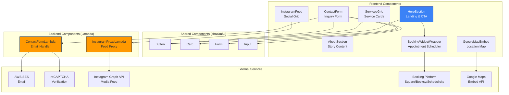

# Components

Based on the architectural patterns, tech stack, and data models, the following components form the complete system architecture across frontend and backend.

## Frontend Components

### HeroSection

**Responsibility:** Full-screen landing section with brand messaging and primary booking CTA

**Key Interfaces:**
- Props: `{ tagline: string, ctaText: string, onBookingClick: () => void }`
- Renders: Background image, animated tagline, booking button
- Emits: `booking_initiated` analytics event on CTA click

**Dependencies:** Framer Motion (scroll animations), booking widget integration

**Technology Stack:** React functional component, Tailwind CSS, Framer Motion `motion.div`, responsive background image with `<picture>` element

---

### ServicesGrid

**Responsibility:** Display barbershop services with pricing in responsive card layout

**Key Interfaces:**
- Props: `{ services: ServiceOffering[] }`
- Renders: shadcn/ui Card components in grid layout
- State: None (static data)

**Dependencies:** shadcn/ui Card component, ServiceOffering data model

**Technology Stack:** React functional component, Tailwind grid layout, shadcn/ui Card, scroll-triggered fade-in animation

---

### ContactForm

**Responsibility:** Collect and validate customer inquiries, submit to Lambda backend

**Key Interfaces:**
- Props: None (self-contained)
- State: Form data (`ContactFormRequest`), submission status, validation errors
- API: POST `/api/contact` with reCAPTCHA token
- Emits: `contact_form_submitted` analytics event on success

**Dependencies:** React Hook Form, shadcn/ui Form components, reCAPTCHA v3, API client

**Technology Stack:** React Hook Form + Zod validation schema, shadcn/ui Input/Textarea/Button, reCAPTCHA invisible widget

---

### InstagramFeed

**Responsibility:** Fetch and display recent Instagram posts in grid layout

**Key Interfaces:**
- Props: `{ limit?: number }`
- State: Instagram posts array, loading state, error state
- API: GET `/api/instagram/feed`
- Emits: `instagram_post_clicked` analytics event on post click

**Dependencies:** Instagram feed API proxy, lazy loading for images

**Technology Stack:** React functional component with `useEffect` hook, Tailwind grid, lazy loading via `loading="lazy"`, fallback skeleton UI

---

### GoogleMapEmbed

**Responsibility:** Display business location with interactive Google Map

**Key Interfaces:**
- Props: `{ address: string, businessName: string }`
- Renders: Embedded Google Maps iframe with location pin

**Dependencies:** Google Maps Embed API

**Technology Stack:** React component wrapping `<iframe>`, responsive container, ARIA labels for accessibility

---

### BookingWidgetWrapper

**Responsibility:** Embed third-party booking platform (Square/Booksy/Schedulicity) for appointment scheduling

**Key Interfaces:**
- Props: `{ config: BookingWidgetConfig, preselectedService?: string }`
- Renders: Platform-specific embed (iframe or redirect button)
- Emits: `booking_initiated` analytics event on widget interaction

**Dependencies:** Selected booking platform SDK/embed code (Story 3.1)

**Technology Stack:** React component with platform-specific integration (iframe, script tag, or API redirect)

---

## Backend Components

### ContactFormLambda

**Responsibility:** Process contact form submissions, validate reCAPTCHA, send email via SES

**Key Interfaces:**
- Input: API Gateway event with `ContactFormRequest` payload
- Output: `ContactFormResponse` (success/error)
- External APIs: Google reCAPTCHA verification, AWS SES

**Dependencies:** AWS SDK (SES), axios/node-fetch (reCAPTCHA verification), input sanitization library

**Technology Stack:** Node.js 20.x Lambda function, `@aws-sdk/client-ses` v3, environment variables for secrets

---

### InstagramProxyLambda

**Responsibility:** Proxy Instagram Graph API requests to secure access token, cache responses

**Key Interfaces:**
- Input: API Gateway event with query parameter `limit`
- Output: `InstagramFeedProxyResponse`
- External APIs: Instagram Graph API (GET `/me/media`)

**Dependencies:** Instagram Graph API, CloudFront caching (1-hour TTL)

**Technology Stack:** Node.js 20.x Lambda function, node-fetch for HTTP requests, environment variables for Instagram access token

---

## Component Diagram

