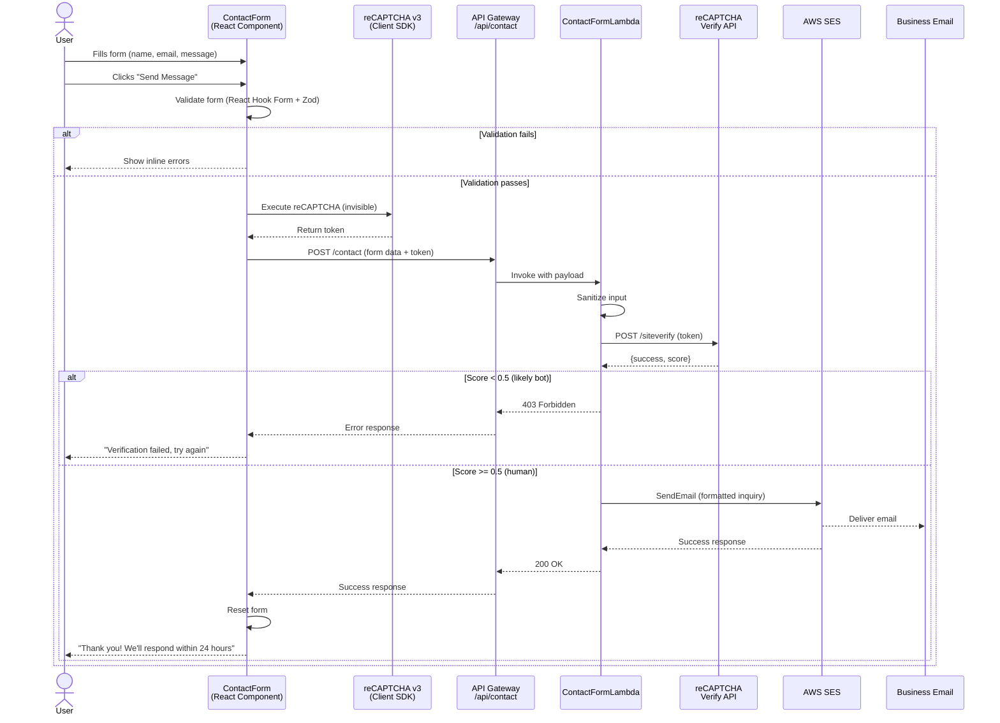
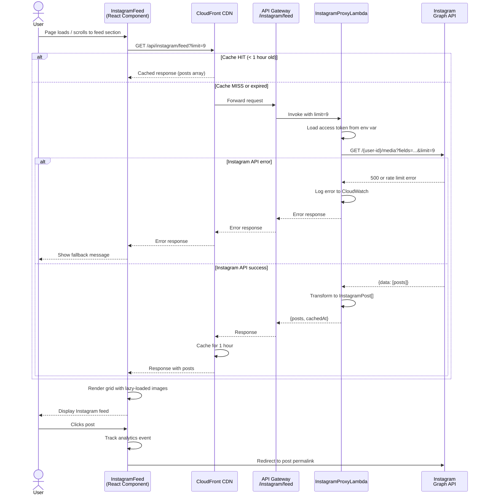
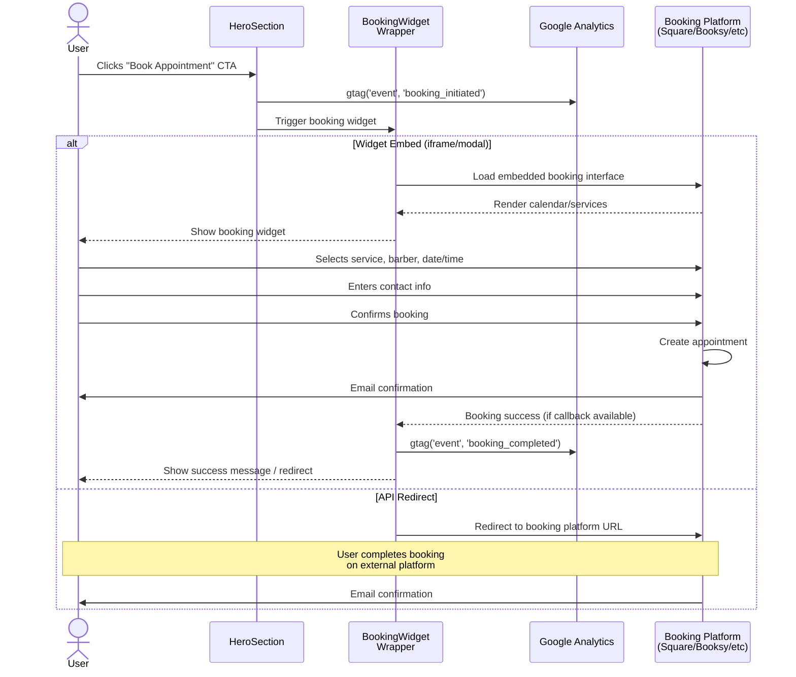
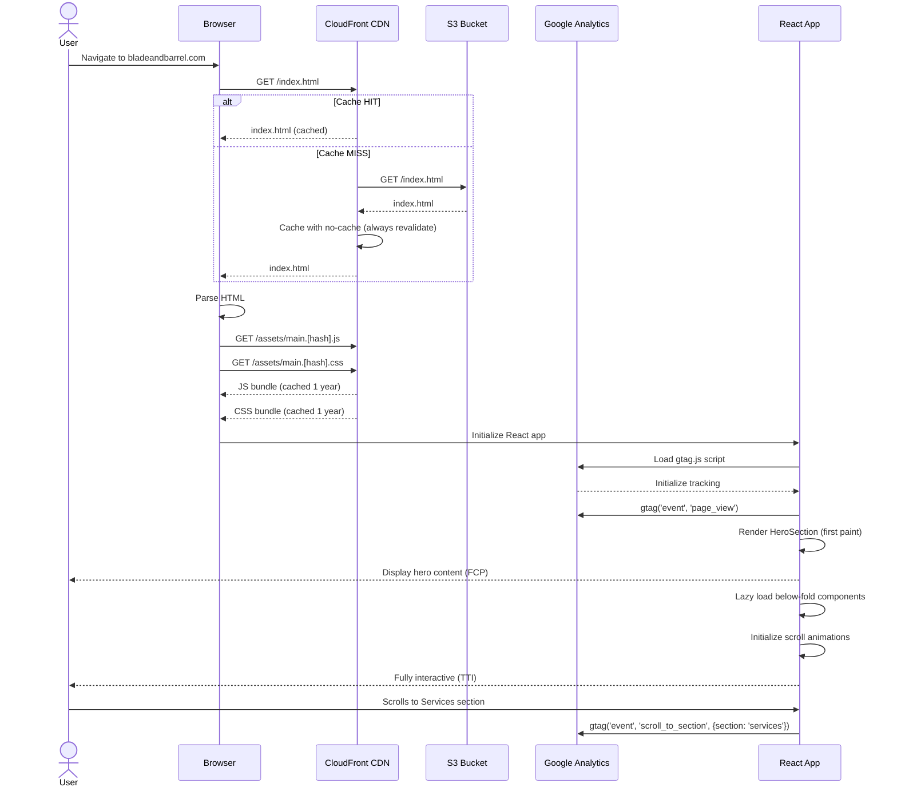

# Core Workflows

These sequence diagrams illustrate critical user journeys showing component interactions across frontend, backend, and external services.

## Contact Form Submission Flow

## Instagram Feed Loading Flow

## Booking Appointment Flow

## Page Load & Analytics Tracking Flow

