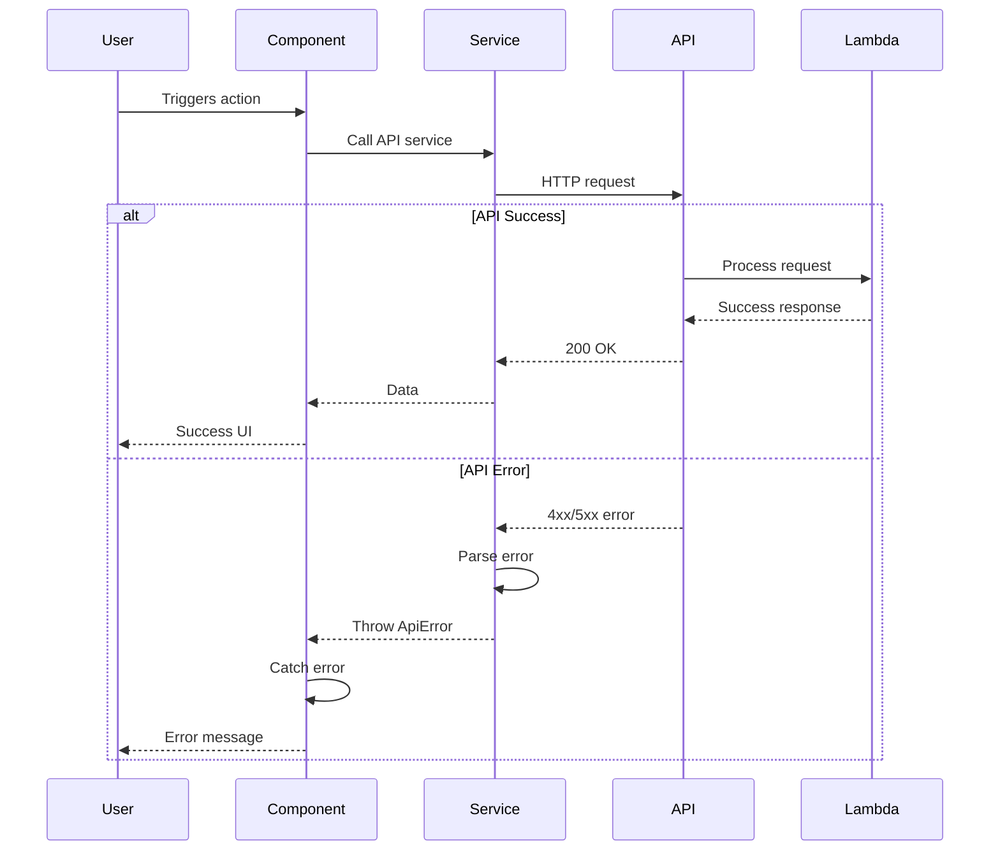

# Error Handling Strategy

## Error Flow



## Error Response Format

```typescript
interface ApiError {
  error: {
    code: string;
    message: string;
    details?: Record<string, any>;
    timestamp: string;
    requestId: string;
  };
}
```

## Frontend Error Handling

```typescript
// /src/lib/errorHandler.ts
export async function handleApiError(error: any): Promise<string> {
  if (error.response?.data?.error) {
    return error.response.data.error.message;
  }
  if (error.message) {
    return error.message;
  }
  return 'An unexpected error occurred. Please try again.';
}

// Usage in component
try {
  await submitContactForm(formData);
  setSuccess(true);
} catch (error) {
  const message = await handleApiError(error);
  setErrorMessage(message);
}
```

## Backend Error Handling

```javascript
// Lambda error handler
exports.handler = async (event) => {
  try {
    // Process request
    return { statusCode: 200, body: JSON.stringify({ success: true }) };
  } catch (error) {
    console.error('Lambda error:', error);

    return {
      statusCode: error.statusCode || 500,
      body: JSON.stringify({
        error: {
          code: error.code || 'INTERNAL_ERROR',
          message: error.message || 'An error occurred',
          timestamp: new Date().toISOString(),
          requestId: event.requestContext?.requestId
        }
      })
    };
  }
};
```
