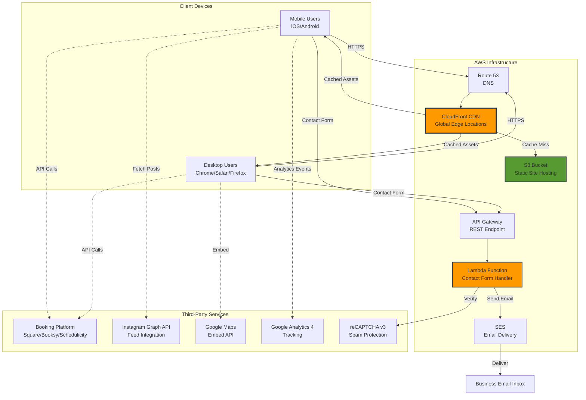

# High Level Architecture

## Technical Summary

The Blade and Barrel website employs a **static site architecture with serverless backend functions**, optimized for performance, scalability, and cost-efficiency. The React-based single-page application is deployed globally via AWS CloudFront CDN, with dynamic functionality handled through serverless Lambda functions and third-party API integrations. The frontend leverages modern React 18 with Vite for rapid development, shadcn/ui component library for consistent UI, and Framer Motion for scroll-triggered animations that create an immersive storytelling experience. AWS infrastructure (S3 static hosting, CloudFront CDN, Lambda for contact forms, SES for email delivery) provides enterprise-grade reliability within free-tier constraints. Third-party integrations handle specialized functionality: booking platform for appointment scheduling, Instagram Graph API for social proof, Google Maps for location services, and Google Analytics 4 for behavioral tracking. This architecture achieves PRD goals of sub-2-second load times, 85+ Lighthouse scores, and seamless mobile-first experience while maintaining operational simplicity for a small team scaling to multi-location expansion.

## Platform and Infrastructure Choice

**Platform:** AWS (Amazon Web Services)

**Key Services:**
- **AWS S3:** Static website hosting for React build artifacts
- **AWS CloudFront:** Global CDN for sub-2-second load times, HTTPS termination, edge caching
- **AWS Lambda:** Serverless contact form processing (Node.js 20.x runtime)
- **AWS SES (Simple Email Service):** Transactional email delivery for contact inquiries
- **AWS Route 53:** DNS management for bladeandbarrel.com domain
- **AWS Certificate Manager (ACM):** Free SSL/TLS certificates for HTTPS
- **AWS API Gateway:** REST endpoint for Lambda contact form function
- **AWS CloudWatch:** Logging and monitoring for Lambda functions and CloudFront

**Deployment Host and Regions:**
- **Primary Region:** us-east-1 (N. Virginia) - required for CloudFront ACM certificates
- **CloudFront Edge Locations:** Global distribution (Tampa-area edge for local customers)
- **Lambda Deployment:** us-east-1 for proximity to other services

**Rationale:**
- **AWS over Vercel/Netlify:** Team's existing AWS and GitHub CI/CD expertise eliminates learning curve
- **Static site over traditional server:** Zero server maintenance, auto-scaling CDN, cost optimization (estimated $5-15/month)
- **Serverless functions:** Pay-per-execution model ideal for contact form (low volume), no idle server costs
- **CloudFront CDN:** Critical for performance requirements (2s load on 4G mobile, 85+ Lighthouse score)

**Why CloudFront + S3 vs. S3 Alone:**
- ✅ **HTTPS with custom domain:** S3 alone can't serve HTTPS on bladeandbarrel.com (only on `*.s3.amazonaws.com`)
- ✅ **Global edge caching:** CloudFront serves files from locations near users (faster than single-region S3)
- ✅ **SPA routing support:** CloudFront rewrites 404s → `index.html` for React Router (S3 can't do this)
- ✅ **Compression & optimization:** Gzip/Brotli compression reduces file sizes automatically

## Repository Structure

**Structure:** Monorepo (single repository)

**Monorepo Tool:** Not applicable - simple single-app structure managed with npm workspaces (if needed for future shared packages)

**Package Organization:**
```
/blade (root)
├── /src                 # React application source code
├── /public              # Static assets (images, favicons)
├── /components          # shadcn/ui components
├── /lambda              # AWS Lambda function code (contact form)
├── /.github/workflows   # CI/CD GitHub Actions
└── /infrastructure      # AWS config (CloudFront, S3 policies - optional IaC)
```

**Rationale:**
- **Monorepo for simplicity:** One-page website doesn't warrant separate frontend/backend repositories
- **Future-proof:** Structure accommodates shared packages if multi-location features require centralized logic
- **Tooling:** npm workspaces available if needed; current scope doesn't require Turborepo/Nx overhead
- **Lambda separation:** `/lambda` folder isolates serverless function code with separate `package.json` for deployment

## High Level Architecture Diagram



## Architectural Patterns

- **Static Site + Serverless APIs:** Pre-built React site (S3) with serverless functions (Lambda) for dynamic features - _Rationale:_ Optimal performance via CDN edge delivery, auto-scaling, cost-efficiency for one-page site with minimal backend logic

- **Component-Based UI (React):** Reusable React functional components with TypeScript for type safety - _Rationale:_ Maintainability across future multi-location features, shadcn/ui provides battle-tested accessible components, strong ecosystem for hiring

- **Serverless Functions (AWS Lambda):** Event-driven Lambda functions for contact form processing - _Rationale:_ Pay-per-execution eliminates idle server costs, auto-scales for traffic spikes (grand opening), zero maintenance

- **API Gateway Pattern:** Single REST endpoint (`/api/contact`) for Lambda invocation - _Rationale:_ Centralized CORS management, request throttling, CloudWatch logging integration

- **CDN-First Delivery:** CloudFront edge caching with SPA routing configuration - _Rationale:_ Achieves 2s load time requirement on 4G mobile, global performance for future expansion, HTTPS enforcement

- **Third-Party Integration Pattern:** Client-side API calls to external services with server-side proxying for sensitive operations - _Rationale:_ Instagram Graph API requires server-side token handling; booking/maps use client-side embeds for simplicity

- **Progressive Enhancement:** Core content loads first (HTML/CSS), JavaScript hydrates for interactivity - _Rationale:_ Ensures accessibility if JS fails, improves Core Web Vitals (FCP/LCP), graceful degradation for older browsers

- **Atomic Design Components:** Organize UI components from atoms (buttons) → molecules (form fields) → organisms (hero section) - _Rationale:_ shadcn/ui follows this pattern, scales cleanly for design system evolution
