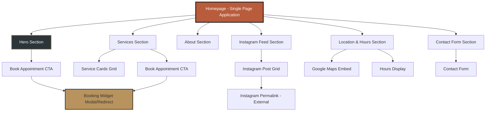
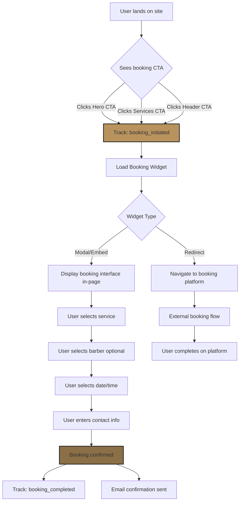
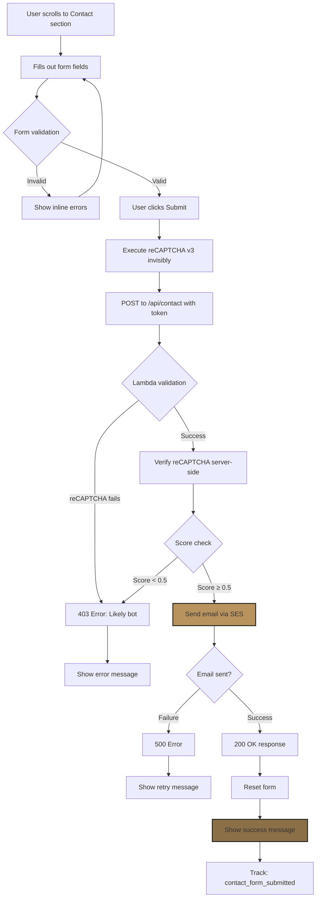
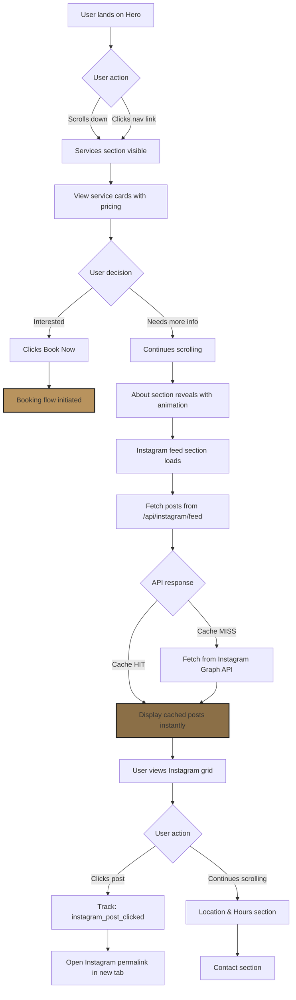

# Blade and Barrel UI/UX Specification

## Introduction

This document defines the user experience goals, information architecture, user flows, and visual design specifications for Blade and Barrel's user interface. It serves as the foundation for visual design and frontend development, ensuring a cohesive and user-centered experience.

### Overall UX Goals & Principles

#### Target User Personas

**Primary Persona - Mobile-First Customer (70% of traffic):**
- Busy professionals and locals in Tampa's Channelside district
- Need quick, seamless mobile booking experience
- Value visual social proof (Instagram feed) and immediate appointment access
- Expect sub-2-second load times on 4G connections

**Secondary Persona - Desktop Browser:**
- Users researching barbershop options, exploring services
- May spend more time reading about the brand story
- Higher engagement with detailed content and map/location features

#### Usability Goals

1. **Speed & Performance:** New users can view services and initiate booking within 2 seconds of page load
2. **Booking Efficiency:** Users can start the booking flow with one tap/click from the hero section
3. **Mobile-First Navigation:** Smooth scroll navigation between sections works flawlessly on mobile devices
4. **Visual Engagement:** Instagram feed loads quickly and provides social proof without sacrificing performance
5. **Error Prevention:** Contact form provides clear validation with reCAPTCHA running invisibly

#### Design Principles

1. **Performance is UX** - Every design decision must support the 2s load time goal and 85+ Lighthouse score
2. **Mobile-First Storytelling** - Design for mobile viewport first, then enhance for larger screens
3. **Progressive Enhancement** - Core content (services, location, contact) loads first; JavaScript enhances interactivity
4. **Visual Hierarchy Through Animation** - Use Framer Motion scroll animations to guide users through the story
5. **Accessible by Default** - WCAG AA compliance through shadcn/ui components, proper contrast, and semantic HTML

### Change Log

| Date | Version | Description | Author |
|------|---------|-------------|---------|
| 2025-10-05 | v1.0 | Initial UI/UX specification creation | Sally (UX Expert) |

---

## Information Architecture (IA)

### Site Map / Screen Inventory



### Navigation Structure

**Primary Navigation:**
Sticky header with smooth-scroll anchor links to sections:
- Services
- About
- Gallery (Instagram)
- Location
- Contact

Mobile: Hamburger menu reveals vertical navigation overlay with same anchor links.

**Secondary Navigation:**
- **Book Appointment CTA** - Persistent button in header (always visible on scroll)
- **Footer Navigation** - Social media links (Instagram, Facebook), business info, privacy policy

**Breadcrumb Strategy:**
Not applicable - single-page application with no hierarchical navigation. Current section indicated via scroll-spy highlighting in nav menu.

---

## User Flows

### User Flow 1: Book Appointment

**User Goal:** Schedule a barbershop appointment with minimal friction

**Entry Points:**
- Hero section "Book Appointment" CTA button
- Services section "Book Now" button
- Persistent header booking button (visible on scroll)

**Success Criteria:**
- User successfully opens booking widget/platform
- Analytics event `booking_initiated` fires
- User lands in booking platform with pre-selected service (if applicable)

#### Flow Diagram



#### Edge Cases & Error Handling

- **Booking widget fails to load:** Display fallback message with phone number to call
- **User closes widget without booking:** Do not track `booking_completed`, allow re-opening
- **Platform redirect fails:** Provide manual link to booking platform URL
- **Mobile keyboard obscures form:** Ensure proper scroll-to-focus behavior
- **User on slow connection:** Show loading spinner, timeout after 10s with error message

**Notes:** Booking platform (Square/Booksy/Schedulicity) handles all appointment logic. Website only needs to successfully invoke the widget/redirect.

---

### User Flow 2: Submit Contact Inquiry

**User Goal:** Send a message to the business (event inquiries, partnerships, general questions)

**Entry Points:**
- Contact section (below-the-fold)
- Navigation menu "Contact" link (scrolls to form)

**Success Criteria:**
- User successfully submits form
- reCAPTCHA verification passes (score ≥ 0.5)
- Email delivered via AWS SES
- Success message displayed to user
- Analytics event `contact_form_submitted` fires

#### Flow Diagram



#### Edge Cases & Error Handling

- **Network timeout:** Show "Request timed out, please try again" message
- **SES delivery failure:** Log error to CloudWatch, show generic error to user
- **User submits multiple times rapidly:** API Gateway throttling prevents spam
- **Invalid email format:** Client-side validation catches before submission
- **Empty required fields:** React Hook Form prevents submission, highlights errors
- **Bot detection triggers false positive:** User can retry or contact via phone (displayed in error message)

**Notes:** Contact form is secondary conversion path. Privacy-conscious users may prefer phone contact.

---

### User Flow 3: Browse Services & View Instagram Feed

**User Goal:** Explore barbershop offerings and view social proof before deciding to book

**Entry Points:**
- Hero section scroll-down indicator
- Navigation menu "Services" or "Gallery" links
- Organic scroll behavior (storytelling flow)

**Success Criteria:**
- User views service offerings with pricing
- User engages with Instagram feed (clicks posts)
- User proceeds to booking or contact after browsing
- Analytics events track section engagement

#### Flow Diagram



#### Edge Cases & Error Handling

- **Instagram API fails:** Show cached posts from previous fetch, or placeholder message
- **Instagram rate limit exceeded:** CloudFront 1-hour cache prevents hitting limit
- **Slow image loading:** Lazy load images with skeleton placeholders
- **User on metered connection:** Progressive image loading (low-res → high-res)
- **Empty Instagram feed:** Gracefully hide section or show "Coming soon" message
- **User scrolls too fast:** Intersection Observer ensures animations trigger at right time

**Notes:** This is the "awareness & consideration" phase of the conversion funnel. Performance is critical here (2s load target).

---

## Wireframes & Mockups

**Primary Design Files:** To be created in Figma (recommended for component handoff to shadcn/ui)

### Key Screen Layouts

#### Layout 1: Hero Section (Above-the-Fold)

**Purpose:**
Immediately capture attention with brand identity and drive users to primary conversion action (booking). Must load in <2s and achieve 85+ Lighthouse score.

**Key Elements:**
- **Full-screen background image** - Hero image from `/images/header-image.jpg` (brick wall + barrel + brand signage)
- **Centered brand lockup** - "BLADE AND BARREL" + "The Bar-bershop" tagline in cream/bone typography
- **Primary CTA button** - "Book Appointment" (brass/gold accent, high contrast)
- **Scroll indicator** - Animated down-arrow to encourage exploration
- **Sticky navigation header** - Logo, nav links, persistent booking CTA (appears on scroll)

**Interaction Notes:**
- Background image uses `<picture>` element with WebP optimization
- Hero text fades in on page load (Framer Motion, 0.8s duration)
- CTA button has hover state with brass glow effect
- Scroll-triggered animation reveals sticky header after 100px scroll
- Mobile: Full viewport height, ensures CTA visible without scrolling

**Design File Reference:** [To be created - Figma frame: "01_Hero_Desktop" and "01_Hero_Mobile"]

---

#### Layout 2: Services Section

**Purpose:**
Display service offerings with clear pricing to inform booking decisions. Must support scanning (F-pattern reading).

**Key Elements:**
- **Section heading** - "Services" (H2, charcoal text on cream background)
- **Service card grid** - 3-column desktop, 1-column mobile (shadcn/ui Card components)
  - **Card content:** Service name, description, price, duration
  - **Service examples:** Haircut ($35, 45min), Beard Trim ($25, 30min), Hot Towel Shave ($45, 60min)
- **Secondary CTA** - "Book Your Appointment" button below grid
- **Background treatment** - Subtle texture or gradient transition from hero

**Interaction Notes:**
- Cards fade-in-up on scroll (staggered, 0.2s delay between cards)
- Hover state: Card elevation increases (shadow depth)
- Price displayed prominently in brass/gold accent color
- Mobile: Cards stack vertically, full-width
- Click card → highlights associated service in booking widget (if platform supports deep-linking)

**Design File Reference:** [To be created - Figma frame: "02_Services_Desktop" and "02_Services_Mobile"]

---

#### Layout 3: About Section

**Purpose:**
Tell brand story and build emotional connection. Emphasize the "bar-bershop" concept (craft beer + grooming).

**Key Elements:**
- **Two-column layout** - Text left, image right (reverses on mobile)
- **Headline** - Brand story hook (e.g., "Where Craft Meets Cut")
- **Body copy** - 2-3 paragraphs describing the experience, atmosphere, Tampa Channelside location
- **Supporting image** - Interior shot from `/images/Barbearia industrial.jpg` or `/images/barber-interior-02.jpg`
- **Visual accent** - Decorative line break or branded graphic element

**Interaction Notes:**
- Parallax scroll effect on image (subtle, accessibility-considerate)
- Text reveals on scroll with fade-in-left animation
- Image lazy-loads with skeleton placeholder
- Mobile: Image stacks above text, reduced parallax effect

**Design File Reference:** [To be created - Figma frame: "03_About_Desktop" and "03_About_Mobile"]

---

#### Layout 4: Instagram Feed Section

**Purpose:**
Social proof via recent Instagram posts. Drive engagement and showcase barbershop culture.

**Key Elements:**
- **Section heading** - "Follow Us @bladeandbarrel" with Instagram icon
- **Post grid** - 3x3 grid desktop (9 posts), 2-column mobile (6 posts visible, "Load More" optional)
- **Post cards** - Square aspect ratio, image thumbnail, caption preview on hover
- **Loading state** - Skeleton grid while fetching from `/api/instagram/feed`
- **Error fallback** - "Follow us on Instagram" CTA if API fails

**Interaction Notes:**
- Grid items fade-in as images load (lazy loading)
- Hover state: Overlay with post caption and engagement metrics (if available)
- Click post → Opens Instagram permalink in new tab
- Track analytics: `instagram_post_clicked` event
- CloudFront caches responses for 1-hour (per architecture)
- Mobile: 2-column grid, reduced post count for performance

**Design File Reference:** [To be created - Figma frame: "04_Instagram_Desktop" and "04_Instagram_Mobile"]

---

#### Layout 5: Location & Hours Section

**Purpose:**
Provide essential business information (address, hours, map) to drive foot traffic.

**Key Elements:**
- **Two-column layout** - Business info left, Google Maps embed right
- **Address display** - Channelside, Tampa, FL with "Get Directions" link
- **Hours table** - Days of week with open/close times
- **Phone number** - Clickable `tel:` link (especially important on mobile)
- **Google Maps embed** - Interactive map with location pin
- **Background treatment** - Dark slate or charcoal section for contrast

**Interaction Notes:**
- Google Maps iframe loads on scroll (Intersection Observer trigger)
- "Get Directions" button opens Google/Apple Maps app on mobile
- Phone number tap-to-call on mobile devices
- Hours display highlights current day
- Mobile: Stacks to single column, map below info

**Design File Reference:** [To be created - Figma frame: "05_Location_Desktop" and "05_Location_Mobile"]

---

#### Layout 6: Contact Form Section

**Purpose:**
Capture inquiries for events, partnerships, general questions. Secondary conversion path.

**Key Elements:**
- **Section heading** - "Get In Touch"
- **Form fields** (shadcn/ui Form + Input components):
  - Name (required)
  - Email (required, validated format)
  - Phone (optional)
  - Message (required, textarea, 10-1000 chars)
- **Submit button** - "Send Message" (brass accent, disabled state while submitting)
- **reCAPTCHA v3 badge** - Invisible, bottom-right corner
- **Success/error messages** - Inline display after submission
- **Alternative contact** - Phone number displayed for users preferring direct contact

**Interaction Notes:**
- Real-time validation with React Hook Form + Zod schema
- Inline error messages appear on blur
- Submit button shows loading spinner during POST request
- reCAPTCHA executes invisibly on submit
- Success: Form resets, green success message displayed
- Error: Red error message, form fields preserved for retry
- Mobile: Full-width form fields, larger touch targets (48px min)

**Design File Reference:** [To be created - Figma frame: "06_Contact_Desktop" and "06_Contact_Mobile"]

---

#### Layout 7: Footer

**Purpose:**
Provide supplementary navigation, legal links, and social media connections.

**Key Elements:**
- **Logo mark** - Small Blade and Barrel icon/wordmark
- **Social media icons** - Instagram, Facebook (open in new tabs)
- **Legal links** - Privacy Policy, Terms of Service (if applicable)
- **Copyright notice** - "© 2025 Blade and Barrel. All rights reserved."
- **Background** - Deep charcoal/black

**Interaction Notes:**
- Minimal height, focuses on legal compliance
- Social icons have hover state (brass accent)
- Links use cream/bone color for contrast on dark background

**Design File Reference:** [To be created - Figma frame: "07_Footer"]

---

## Component Library / Design System

**Design System Approach:**
Use **shadcn/ui** as the foundational component library (as specified in architecture). shadcn/ui provides accessible, customizable React components built on Radix UI primitives with Tailwind CSS styling. Components are copy-pasted into the project (not installed as dependencies), allowing full customization while maintaining WCAG AA compliance.

**Rationale:** Aligns with architecture tech stack, enables rapid development, ensures accessibility out-of-the-box, integrates seamlessly with Tailwind CSS theming.

### Core Components

#### Component: Button

**Purpose:**
Primary and secondary call-to-action elements throughout the site.

**Variants:**
- **Primary** - Brass/gold background (`#B8935E`), charcoal text, used for booking CTAs
- **Secondary** - Charcoal outline, transparent background, cream text, used for secondary actions
- **Ghost** - No background, underline on hover, used for text links

**States:**
- Default
- Hover (brightness increase, subtle scale transform)
- Active/Pressed (slight scale decrease)
- Disabled (50% opacity, no pointer events)
- Loading (spinner icon, disabled state)

**Usage Guidelines:**
- Minimum touch target: 48px height on mobile, 44px desktop
- Primary buttons limited to 1-2 per screen section (booking CTAs)
- Use sentence case for button labels ("Book appointment" not "BOOK APPOINTMENT")
- Include appropriate ARIA labels for screen readers

---

#### Component: Card

**Purpose:**
Container component for service offerings, Instagram posts, and content groupings.

**Variants:**
- **Elevated** - Default with subtle shadow, used for service cards
- **Flat** - No shadow, border only, used for informational content
- **Interactive** - Hover elevation increase, used for clickable Instagram posts

**States:**
- Default
- Hover (shadow depth increases, slight translate-y)
- Focus (visible outline for keyboard navigation)
- Loading (skeleton state with shimmer animation)

**Usage Guidelines:**
- Maintain 4:5 aspect ratio for Instagram post cards (square)
- Service cards use vertical layout with clear hierarchy (name → description → price)
- Ensure 4.5:1 contrast ratio between card background and page background
- Add `role="article"` for service cards, `role="link"` for clickable Instagram cards

---

#### Component: Form & Input

**Purpose:**
Contact form with accessible, validated input fields.

**Variants:**
- **Text input** - Single-line text (name, email, phone)
- **Textarea** - Multi-line text (message field)
- **Label** - Always visible, positioned above input
- **Error message** - Red text below input, visible on validation failure
- **Helper text** - Gray text below input for optional guidance

**States:**
- Empty (placeholder text visible)
- Filled
- Focus (brass outline, 2px)
- Error (red outline, error message displayed)
- Disabled (gray background, no interaction)
- Valid (optional green checkmark icon)

**Usage Guidelines:**
- Always pair inputs with visible labels (no placeholder-only labels)
- Use `autocomplete` attributes for name, email, phone
- Error messages use specific, actionable language ("Enter a valid email like you@example.com")
- Required fields marked with asterisk (*) in label
- Input height minimum 44px for touch targets

---

#### Component: Navigation Menu

**Purpose:**
Primary navigation for scrolling to sections, with mobile hamburger menu.

**Variants:**
- **Desktop horizontal nav** - Inline links in header
- **Mobile hamburger menu** - Full-screen overlay with vertical links
- **Sticky header** - Appears on scroll with background overlay

**States:**
- Default (transparent background on hero)
- Scrolled (solid charcoal background, shadow)
- Active link (brass underline indicator for current section)
- Hover (brass color transition)
- Mobile menu open/closed

**Usage Guidelines:**
- Scroll-spy highlights current section link
- Smooth scroll behavior with offset for sticky header height
- Mobile menu uses slide-in animation from right
- Close button (X) in top-right of mobile menu
- Hamburger icon transforms to X on open (animated)

---

#### Component: Section Container

**Purpose:**
Consistent spacing and layout wrapper for each page section.

**Variants:**
- **Light background** - Cream/white for services, contact
- **Dark background** - Charcoal for location/hours, footer
- **Image background** - Hero section with overlay

**States:**
- Default
- In-view (triggers scroll animations via Intersection Observer)

**Usage Guidelines:**
- Vertical padding: 80px desktop, 48px mobile
- Max-width: 1280px centered container
- Horizontal padding: 24px (prevents edge-to-edge content on mobile)
- Alternate light/dark backgrounds for visual rhythm
- Add `<section>` semantic HTML with descriptive `aria-label`

---

#### Component: Instagram Post Grid Item

**Purpose:**
Individual Instagram post within the feed grid.

**Variants:**
- **Image post** - Photo thumbnail
- **Video post** - Video thumbnail with play icon overlay
- **Carousel post** - Multi-image icon indicator

**States:**
- Loading (skeleton shimmer)
- Loaded (fade-in animation)
- Hover (caption overlay with darkened background)
- Error (placeholder image with "View on Instagram" fallback)

**Usage Guidelines:**
- Square aspect ratio (1:1) for grid consistency
- Lazy load images using `loading="lazy"` attribute
- Include alt text from Instagram caption (truncated to 125 chars)
- Use `<a>` tag wrapping image for keyboard accessibility
- Track click events to GA4 before opening permalink

---

#### Component: Google Maps Embed

**Purpose:**
Interactive map showing barbershop location.

**Variants:**
- Single variant (responsive iframe embed)

**States:**
- Loading (gray placeholder with address text)
- Loaded (interactive map)
- Error (static address with "Get Directions" link fallback)

**Usage Guidelines:**
- Lazy load iframe using Intersection Observer (trigger when section in view)
- Aspect ratio: 16:9 desktop, 4:3 mobile
- Include `title` attribute on iframe for screen readers
- Provide text address above/beside map for users who can't interact with iframe
- "Get Directions" link opens Google Maps app on mobile

---

## Branding & Style Guide

### Visual Identity

**Brand Guidelines:**
Blade and Barrel embodies a **modern industrial-rustic aesthetic** that merges traditional barbershop craftsmanship with contemporary bar culture. The visual identity draws from exposed brick, weathered wood, brass fixtures, and vintage signage to create a masculine, authentic atmosphere that appeals to discerning professionals in Tampa's Channelside district.

**Brand Personality:**
- **Authentic** - Real materials, honest craft, no pretense
- **Bold** - Strong typography, high-contrast visuals, confident statements
- **Refined** - Attention to detail, quality over quantity, curated experience
- **Social** - Community-focused, welcoming, "third place" atmosphere

---

### Color Palette

| Color Type | Hex Code | Usage |
|------------|----------|-------|
| **Primary** | `#B85C3C` | Burnt orange/rust - Accent elements, section backgrounds, hover states. Derived from exposed brick texture (dominant brand visual). |
| **Secondary** | `#1A1A1A` | Deep charcoal/black - Primary text, dark section backgrounds, navigation elements, barber chair aesthetic. |
| **Accent** | `#B8935E` | Brass/gold - Call-to-action buttons, interactive elements, logo details, metal fixture inspiration. |
| **Success** | `#6B8E23` | Olive green - Form success messages, positive confirmations (natural, understated). |
| **Warning** | `#D97706` | Amber - Important notices, cautions (complements rust primary). |
| **Error** | `#DC2626` | Red - Form validation errors, destructive action warnings. |
| **Neutral Dark** | `#2C3539` | Dark slate - Secondary surfaces, card backgrounds on light sections, modern industrial elements. |
| **Neutral Mid** | `#8B6F47` | Warm wood/tan - Supporting text, borders, wooden barrel/floor inspiration. |
| **Neutral Light** | `#D4C4B0` | Light taupe - Subtle backgrounds, low-emphasis content. |
| **Background Light** | `#E8DCC8` | Cream/bone - Primary light section backgrounds, typography on dark surfaces (header image). |
| **Background Dark** | `#0F0F0F` | Rich black - Footer, hero overlay, high-contrast dark sections. |

**Color Accessibility Notes:**
- All text colors tested for WCAG AA compliance (4.5:1 contrast for body text, 3:1 for large text)
- Primary brass (`#B8935E`) on dark charcoal (`#1A1A1A`) = 6.2:1 contrast ratio ✓
- Cream (`#E8DCC8`) on burnt orange (`#B85C3C`) = 5.1:1 contrast ratio ✓
- Never use rust primary for body text on light backgrounds (insufficient contrast)

---

### Typography

#### Font Families

- **Primary (Headings):** "Bebas Neue" or "Oswald" - Bold, condensed sans-serif for strong brand voice and industrial aesthetic
- **Secondary (Body):** "Inter" or "Open Sans" - Clean, highly legible sans-serif for long-form reading on screens
- **Monospace (Optional):** "JetBrains Mono" - For technical elements, code snippets, or stylized date/time displays (minimal usage)

**Font Loading Strategy:**
Use `font-display: swap` to prevent layout shift, load only required weights (400, 600, 700 for body; 700 for headings).

#### Type Scale

| Element | Size (Desktop) | Size (Mobile) | Weight | Line Height |
|---------|---------------|---------------|--------|-------------|
| **H1** | 64px (4rem) | 40px (2.5rem) | 700 (Bold) | 1.1 |
| **H2** | 48px (3rem) | 32px (2rem) | 700 (Bold) | 1.2 |
| **H3** | 32px (2rem) | 24px (1.5rem) | 600 (Semibold) | 1.3 |
| **H4** | 24px (1.5rem) | 20px (1.25rem) | 600 (Semibold) | 1.4 |
| **Body Large** | 18px (1.125rem) | 16px (1rem) | 400 (Regular) | 1.6 |
| **Body** | 16px (1rem) | 16px (1rem) | 400 (Regular) | 1.6 |
| **Small** | 14px (0.875rem) | 14px (0.875rem) | 400 (Regular) | 1.5 |
| **Caption** | 12px (0.75rem) | 12px (0.75rem) | 400 (Regular) | 1.4 |

**Typography Guidelines:**
- Max line length: 65-75 characters for optimal readability
- Paragraph spacing: 1.5em bottom margin
- Heading hierarchy: Always use semantic HTML (`<h1>` through `<h6>`) even if visually styled differently
- Letter spacing: +0.5px for all-caps headings to improve legibility

---

### Iconography

**Icon Library:**
**Lucide React** (modern, consistent icon set with excellent tree-shaking support for Vite)

**Alternative:** Heroicons (if preferring Tailwind Labs ecosystem consistency)

**Usage Guidelines:**
- Icon size: 24px default, 20px for inline text, 32px+ for primary CTAs
- Stroke width: 2px (matches Lucide default)
- Color: Inherit from parent text color or use brass accent (`#B8935E`) for interactive elements
- Always pair icons with text labels (never icon-only buttons except universally recognized patterns like hamburger menu, close X)
- Use `aria-hidden="true"` on decorative icons, provide `aria-label` on functional icon buttons

**Key Icons Used:**
- **Calendar** - Booking CTAs
- **MapPin** - Location section
- **Mail** - Contact form
- **Instagram** - Social media links
- **ChevronDown** - Scroll indicator
- **Menu** - Mobile hamburger
- **X** - Close modals/mobile menu

---

### Spacing & Layout

**Grid System:**
**12-column responsive grid** with Tailwind CSS grid utilities. Container max-width: 1280px (centered).

**Breakpoints (Tailwind defaults):**
- `sm`: 640px
- `md`: 768px
- `lg`: 1024px
- `xl`: 1280px
- `2xl`: 1536px

**Spacing Scale (Tailwind):**
```
4px  (spacing-1)   → Tight internal spacing
8px  (spacing-2)   → Icon-to-text gaps
12px (spacing-3)   → Small component padding
16px (spacing-4)   → Default component padding
24px (spacing-6)   → Section internal spacing
32px (spacing-8)   → Component-to-component gaps
48px (spacing-12)  → Section padding (mobile)
64px (spacing-16)  → Medium section gaps
80px (spacing-20)  → Section padding (desktop)
96px (spacing-24)  → Large section gaps
128px (spacing-32) → Extra large section breaks
```

**Layout Guidelines:**
- **Vertical rhythm:** Use consistent 8px base unit for all spacing
- **Section padding:** 80px top/bottom desktop, 48px mobile
- **Container padding:** 24px horizontal to prevent edge-bleeding on mobile
- **Card gaps:** 24px (grid-gap) between service cards, Instagram posts
- **Component internal padding:** 16px minimum for touch-friendly interaction areas

---

## Accessibility Requirements

### Compliance Target

**Standard:** WCAG 2.1 Level AA compliance

**Rationale:**
Level AA is the industry-standard baseline for commercial websites, balancing comprehensive accessibility with practical implementation. shadcn/ui components provide WCAG AA compliance out-of-the-box, aligning with the architecture's technology choices.

**Legal Context:**
ADA Title III applies to places of public accommodation. While barbershops are physical locations, their websites must be accessible to avoid discrimination claims.

---

### Key Requirements

**Visual:**

- **Color contrast ratios:**
  - Body text (16px): Minimum 4.5:1 contrast ratio
  - Large text (24px+): Minimum 3:1 contrast ratio
  - Interactive elements (buttons, links): Minimum 3:1 against background
  - All color combinations tested and documented in Branding section
  - Never rely on color alone to convey information (use icons + text)

- **Focus indicators:**
  - Visible focus outline on ALL interactive elements (buttons, links, form inputs, cards)
  - Minimum 2px outline with 3:1 contrast against background
  - Default: Brass accent (`#B8935E`) or browser default blue
  - Focus outline never removed via CSS (`outline: none` forbidden without alternative)

- **Text sizing:**
  - Users must be able to zoom to 200% without horizontal scrolling
  - Use relative units (`rem`, `em`) instead of fixed pixels for text
  - Minimum text size: 16px (1rem) for body copy
  - Touch targets: Minimum 44x44px (mobile), 48x48px recommended

**Interaction:**

- **Keyboard navigation:**
  - All interactive elements accessible via `Tab`, `Shift+Tab`
  - Logical tab order follows visual layout (top-to-bottom, left-to-right)
  - Skip-to-content link for bypassing navigation (visually hidden, revealed on focus)
  - Modal/overlay traps focus (cannot tab outside while open)
  - `Enter` and `Space` activate buttons/links
  - Smooth scroll navigation via keyboard (arrow keys or custom shortcuts)

- **Screen reader support:**
  - Semantic HTML (`<header>`, `<nav>`, `<main>`, `<section>`, `<footer>`)
  - `aria-label` on sections ("Hero section", "Services", "Contact form")
  - `aria-live` regions for dynamic content (form submission feedback, Instagram feed loading)
  - `alt` text for all images (descriptive for meaningful images, empty `alt=""` for decorative)
  - Form labels always associated with inputs (`<label for="...">`)
  - Button text descriptive ("Book appointment" not just "Book")
  - Link text meaningful out of context (avoid "click here")

- **Touch targets:**
  - Minimum 44x44px tap area on mobile (48x48px recommended)
  - Adequate spacing between interactive elements (minimum 8px gaps)
  - Buttons and links have sufficient padding for easy tapping
  - Form inputs full-width on mobile to maximize touch area

**Content:**

- **Alternative text:**
  - Hero background image: `alt=""` (decorative, text content provides context)
  - Service icons (if used): `alt="Haircut service"` (descriptive)
  - Instagram posts: First 125 characters of caption as alt text
  - Logo images: `alt="Blade and Barrel logo"`
  - Decorative graphics: `alt=""` with `aria-hidden="true"`

- **Heading structure:**
  - Single `<h1>` per page ("Blade and Barrel" in hero)
  - Logical hierarchy: `<h1>` → `<h2>` → `<h3>` (no skipping levels)
  - Section headings use `<h2>` (Services, About, Gallery, Location, Contact)
  - Subsection headings use `<h3>` if needed
  - Never style headings purely for visual effect (maintain semantic meaning)

- **Form labels:**
  - Every input has a visible `<label>` (not placeholder-only)
  - Required fields marked with asterisk (*) in label text
  - Error messages associated with inputs via `aria-describedby`
  - Group related inputs with `<fieldset>` and `<legend>` if applicable
  - Autocomplete attributes for name, email, phone (`autocomplete="name"`, etc.)

---

### Testing Strategy

**Automated Testing:**
- **Lighthouse accessibility audit:** Target score 95+ (run in CI/CD pipeline)
- **axe-core integration:** Install `@axe-core/react` for development-time checks
- **eslint-plugin-jsx-a11y:** Catch accessibility issues during linting
- **pa11y-ci:** Automated accessibility testing in GitHub Actions

**Manual Testing:**
- **Keyboard-only navigation:** Test entire site flow without mouse
- **Screen reader testing:** VoiceOver (macOS/iOS), NVDA (Windows), TalkBack (Android)
  - Test critical flows: booking, contact form submission, navigation
- **Browser zoom testing:** Ensure layout works at 200% zoom (Chrome, Firefox, Safari)
- **Color blindness simulation:** Use browser DevTools (Chrome: Rendering panel) to test deuteranopia, protanopia, tritanopia
- **Low vision testing:** Increase text size via browser settings, ensure readability

**Real User Testing:**
- **Optional (post-launch):** Partner with local accessibility advocacy groups in Tampa for feedback
- **Analytics monitoring:** Track keyboard navigation usage, screen reader sessions via GA4 custom events

**Testing Checklist (Pre-Launch):**
- [ ] All interactive elements keyboard-accessible
- [ ] Focus indicators visible on all components
- [ ] Screen reader announces all content meaningfully
- [ ] Form validation errors announced to assistive tech
- [ ] Images have appropriate alt text
- [ ] Color contrast meets WCAG AA minimums
- [ ] Page can be zoomed to 200% without breaking layout
- [ ] Heading hierarchy logical and sequential
- [ ] Skip-to-content link functional

---

## Responsiveness Strategy

### Breakpoints

| Breakpoint | Min Width | Max Width | Target Devices | Design Considerations |
|------------|-----------|-----------|----------------|----------------------|
| **Mobile** | 320px | 767px | iPhone SE, Android phones, small devices | Single-column layouts, stacked sections, hamburger menu, full-width CTAs, 70% of traffic target |
| **Tablet** | 768px | 1023px | iPad, Android tablets, small laptops | 2-column grids where appropriate, hybrid nav (may keep hamburger), larger touch targets |
| **Desktop** | 1024px | 1279px | Laptops, desktop monitors | Multi-column layouts, horizontal nav, hover states emphasized, mouse-optimized interactions |
| **Wide** | 1280px | - | Large monitors, 4K displays | Max-width container (1280px) prevents over-stretching, generous whitespace on sides |

**Base Breakpoint:** 320px (smallest modern device, iPhone SE)

**Critical Breakpoint:** 768px (mobile-to-desktop transition aligns with 70% mobile traffic priority from architecture)

---

### Adaptation Patterns

**Layout Changes:**

- **Mobile (≤767px):**
  - Single-column layouts for all sections
  - Service cards stack vertically (full-width)
  - Instagram grid: 2 columns (6 posts visible)
  - About section: Image stacks above text
  - Location section: Map below business info
  - Forms: Full-width inputs with 48px min height
  - Footer: Stacked links (vertical)

- **Tablet (768px-1023px):**
  - Service cards: 2-column grid
  - Instagram grid: 3 columns (9 posts visible)
  - About section: Side-by-side at 60/40 text-to-image ratio
  - Location section: 50/50 split (info left, map right)
  - Forms: 2-column for name/email, full-width for message
  - Footer: 2-3 column layout

- **Desktop (≥1024px):**
  - Service cards: 3-column grid
  - Instagram grid: 3 columns (9 posts visible, larger thumbnails)
  - About section: 50/50 split with parallax effect
  - Location section: 40/60 split (info left, larger map right)
  - Forms: Optimized multi-column layout
  - Footer: 4-column layout with logo

**Navigation Changes:**

- **Mobile (≤767px):**
  - Hamburger menu icon (top-right)
  - Full-screen overlay navigation (slide-in from right)
  - Vertical link stack with large touch targets (56px height)
  - Close button (X) in top-right
  - "Book Appointment" CTA at bottom of mobile menu (sticky)

- **Tablet (768px-1023px):**
  - **Option A:** Keep hamburger menu for cleaner header
  - **Option B:** Show horizontal nav if space allows (≤5 links)
  - Persistent booking CTA in header regardless of choice

- **Desktop (≥1024px):**
  - Horizontal navigation links in header
  - Hover states with brass underline animation
  - "Book Appointment" button as standalone CTA (right-aligned)
  - Sticky header appears on scroll with subtle shadow

**Content Priority:**

- **Mobile-First Hierarchy:**
  1. **Hero CTA** - "Book Appointment" visible above fold
  2. **Services** - Quick scan of offerings and pricing
  3. **About** - Condensed to 1-2 paragraphs (expandable "Read More" optional)
  4. **Instagram** - Reduced to 6 posts (2x3 grid) to minimize scroll
  5. **Location** - Business hours and address prioritized over map
  6. **Contact** - Tap-to-call phone number more prominent than form

- **Desktop Content Expansion:**
  - About section: Full storytelling copy (3-4 paragraphs)
  - Instagram: Full 9-post grid (3x3)
  - Location: Larger interactive map
  - Contact: Form and phone displayed equally

**Interaction Changes:**

- **Mobile:**
  - Touch-optimized: Minimum 48x48px tap targets
  - Scroll-based navigation (smooth scroll with offset for sticky header)
  - Swipe gestures for Instagram grid (optional enhancement)
  - Tap-to-call links on phone numbers (`<a href="tel:...">`)
  - Tap-to-email links on email addresses (`<a href="mailto:...">`)
  - No hover states (focus on touch feedback)
  - Form inputs trigger appropriate keyboards (email, tel, text)

- **Tablet:**
  - Hybrid touch + mouse support
  - Larger interactive areas maintained
  - Hover states subtle (users may or may not have mouse)

- **Desktop:**
  - Mouse-optimized hover states (color transitions, elevation changes)
  - Keyboard navigation emphasized (visible focus indicators)
  - Cursor changes to pointer on interactive elements
  - Parallax scroll effects enabled (disabled on mobile for performance)

---

## Animation & Micro-interactions

### Motion Principles

**Purpose-Driven Motion:**
Animations serve functional purposes—guiding attention, providing feedback, creating narrative flow—never purely decorative.

**Performance-First:**
All animations must maintain 60fps performance. Animate only `transform` and `opacity` properties (GPU-accelerated). Avoid animating `width`, `height`, `top`, `left` (trigger layout reflow).

**Respectful of User Preferences:**
Honor `prefers-reduced-motion` media query—provide instant transitions or subtle alternatives for users with vestibular disorders or motion sensitivity.

**Brand Personality Through Motion:**
Confident, purposeful movement reflecting the "bold yet refined" brand identity. Use ease-out curves for entering elements (decisive), ease-in-out for transitions (smooth, controlled).

**Timing Philosophy:**
- **Fast interactions** (100-200ms): Button feedback, hover states
- **Medium transitions** (300-500ms): Section reveals, card animations
- **Slow storytelling** (600-1000ms): Hero fade-in, parallax effects

---

### Key Animations

**1. Hero Section Fade-In**
- **Description:** Page load animation—background image fades in with overlay, followed by staggered text reveal (logo → tagline → CTA button)
- **Duration:** 800ms total (background 500ms, text stagger 300ms)
- **Easing:** `cubic-bezier(0.4, 0, 0.2, 1)` (ease-out)

**2. Scroll-Triggered Section Reveals**
- **Description:** As user scrolls, sections fade-in-up (translate Y from 40px to 0, opacity 0 to 1) when entering viewport
- **Duration:** 600ms
- **Easing:** `cubic-bezier(0.16, 1, 0.3, 1)` (bounce-out for "arrival" feel)

**3. Button Hover & Active States**
- **Description:** Primary CTA buttons scale slightly on hover (1.02x), add brass glow shadow; on click, scale down (0.98x) for tactile feedback
- **Duration:** 150ms (hover), 100ms (active)
- **Easing:** `ease-out` (hover), `ease-in` (active press)

**4. Navigation Scroll-Spy Underline**
- **Description:** Active navigation link underline animates width from 0 to 100% when section becomes active (scroll-spy detection)
- **Duration:** 300ms
- **Easing:** `ease-in-out`

**5. Mobile Menu Slide-In**
- **Description:** Hamburger menu opens with slide-in from right (translateX 100% to 0) with backdrop fade-in
- **Duration:** 300ms (slide), 200ms (backdrop fade)
- **Easing:** `cubic-bezier(0.4, 0, 0.2, 1)` (ease-out)

**6. Instagram Grid Item Hover**
- **Description:** Desktop only—image scales up slightly (1.05x) with caption overlay fade-in on hover
- **Duration:** 250ms
- **Easing:** `ease-out`

**7. Form Input Focus Animation**
- **Description:** Input border transitions from neutral gray to brass accent on focus, with subtle glow shadow
- **Duration:** 200ms
- **Easing:** `ease-out`

**8. Service Card Stagger Reveal**
- **Description:** Service cards appear in sequence (left-to-right, top-to-bottom) with 100ms delay between each
- **Duration:** 600ms per card
- **Easing:** `ease-out`

**9. Loading Spinner (Contact Form Submission)**
- **Description:** Rotating circle animation on submit button during API call
- **Duration:** Continuous rotation (360deg/800ms)
- **Easing:** `linear`

**10. Parallax Scroll Effect (About Section Image)**
- **Description:** Desktop only—background image scrolls at 0.5x speed relative to foreground text (subtle depth)
- **Mobile:** Disabled for performance

**11. Success/Error Message Fade-In**
- **Description:** Form submission feedback appears with fade-in + slight slide-down (20px)
- **Duration:** 300ms
- **Easing:** `ease-out`

---

## Performance Considerations

### Performance Goals

- **Page Load:** First Contentful Paint (FCP) <1.5s, Largest Contentful Paint (LCP) <2.0s on 4G mobile connection
- **Interaction Response:** Time to Interactive (TTI) <3.0s, First Input Delay (FID) <100ms
- **Animation FPS:** Maintain 60fps for all animations, no jank during scroll

**Lighthouse Target:** 85+ on all metrics (Performance, Accessibility, Best Practices, SEO)

---

### Design Strategies

**Image Optimization:**
- Use WebP format with JPEG/PNG fallbacks via `<picture>` element
- Implement responsive images with appropriate breakpoints (640px, 1024px, 1920px)
- Lazy load all below-fold images (`loading="lazy"`)
- Hero image eager-loaded and optimized as critical LCP element
- Compress images to 80% quality (imperceptible quality loss, significant size reduction)
- Maximum file sizes: Hero 150KB (mobile), 300KB (desktop); Instagram thumbnails 50KB each

**Code Splitting & Lazy Loading:**
- Lazy load Instagram feed component (only fetch when section in view)
- Lazy load booking widget (on-demand when CTA clicked)
- Google Maps iframe lazy loads via Intersection Observer
- Split vendor bundles (React, Framer Motion) for better caching

**CSS Optimization:**
- Tailwind CSS PurgeCSS removes unused styles (target <30KB gzipped CSS)
- Critical CSS inlined in `<head>` for above-fold content
- shadcn/ui components tree-shaken (only import used components)

**JavaScript Bundle Size:**
- Target: <200KB gzipped total JavaScript (aligns with architecture requirement)
- Tree-shake Framer Motion (only import used features)
- Minimize third-party scripts (GA4, reCAPTCHA loaded asynchronously)
- Use production React build with minification

**Font Loading:**
- Use `font-display: swap` to prevent FOIT (Flash of Invisible Text)
- Subset fonts to Latin character set only (reduces file size 60-70%)
- Preload critical fonts in `<head>`: `<link rel="preload" as="font">`
- Limit to 2 font families, 3 weights total

**Caching Strategy (CloudFront):**
- Static assets (JS/CSS/images): Cache-Control `max-age=31536000` (1 year), immutable
- HTML: Cache-Control `no-cache, no-store, must-revalidate` (always revalidate)
- Instagram API responses: CloudFront edge cache 1 hour
- Service Worker (optional post-MVP): Cache assets for offline fallback

**Third-Party Script Management:**
- Load GA4 asynchronously with `async` attribute
- Defer non-critical scripts (reCAPTCHA badge)
- Use facade pattern for heavy embeds (booking widget only loads on interaction)

**Perceived Performance:**
- Skeleton screens for loading states (Instagram feed, forms)
- Optimistic UI updates (form submission shows success immediately, syncs in background)
- Stagger animations create perception of faster load (progressive reveal)

---

## Next Steps

### Immediate Actions

1. **Review and approve this UI/UX specification** with stakeholders (business owner, design team, development team)
2. **Create high-fidelity mockups in Figma** based on wireframes and style guide specifications
3. **Build interactive prototype** in Figma to validate user flows (booking, contact form, navigation)
4. **Conduct usability testing** with 3-5 representative users (mobile-first focus)
5. **Hand off to frontend development team** with architecture document + this spec + Figma files
6. **Set up design tokens in Tailwind config** (colors, spacing, typography from style guide)
7. **Initialize shadcn/ui component library** in project with customized theme

---

### Design Handoff Checklist

- [x] All user flows documented
- [x] Component inventory complete
- [x] Accessibility requirements defined (WCAG 2.1 AA)
- [x] Responsive strategy clear (mobile-first, 4 breakpoints)
- [x] Brand guidelines incorporated (color palette, typography, spacing)
- [x] Performance goals established (85+ Lighthouse, <2s LCP)
- [ ] Figma high-fidelity mockups created (Pending)
- [ ] Interactive prototype built (Pending)
- [ ] Usability testing completed (Pending)
- [ ] Design tokens exported for Tailwind config (Pending)
- [ ] Image assets optimized and organized (Pending)

---

### Open Questions & Decisions Needed

1. **Booking Platform Selection:** Pending decision between Square Appointments, Booksy, or Schedulicity (Story 3.1 per architecture)
2. **Instagram Business Account Setup:** Requires Facebook Page linkage and Instagram Graph API access token
3. **Content Copywriting:** About section storytelling copy, service descriptions need finalization
4. **Photography:** Professional interior/exterior photography for hero, about section (or source from existing images folder)
5. **Legal Pages:** Privacy Policy, Terms of Service (required for reCAPTCHA compliance and general business)

---

**Document Status:** ✅ Complete and ready for design phase

---
